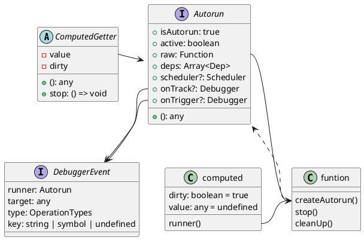

> Commit ID: 3401f6b460196ce254a73df05ce571802b365054

先从依赖关系最少的看起来，逐步看完这个第一份提交记录的内容。所以对应的版本才到`3.0.0-alpha.1`，阅读代码的时候有很多没有被使用的地方。

## RuntimeDom

这个应该是vue的入口。

`nodeOps`定义了一些常用的节点操作，例如创建元素、文本，追加、插入、删除元素，父、邻节点查找，Selector。

`teardownVNode`定义了`vNode`的销毁操作，使用`handleDelegatedEvent`。`handleDelegatedEvent`最后一个参数给`null`，可以去除相关的事件监听, 其只负责处理如下事件。

```javascript
const delegateRE = /^(?:click|dblclick|submit|(?:key|mouse|touch).*)$/
```

顺着`handleDelegatedEvent`阅读下去，如果同名的事件监听数量为1，移除过程就从`document`中移除这个代理事件监听（`removeGlobalHandler`），为0则在创建全局的事件代理（`attachGlobalHandler`）。同时代码也表明`el`元素下有属性`__events`存着事件的处理函数，如果不存在则全局同名事件数量加一。

```typescript
function attachGlobalHandler(name: string) {
  const handler = (attachedGlobalHandlers[name] = (e: Event) => {
    const { type } = e
    const isClick = type === 'click' || type === 'dblclick'
    if (isClick && (e as MouseEvent).button !== 0) {
      e.stopPropagation()
      return false
    }
    e.stopPropagation = stopPropagation
    const targetRef: TargetRef = { el: document }
    Object.defineProperty(e, 'currentTarget', {
      configurable: true,
      get() {
        return targetRef.el
      }
    })
    dispatchEvent(e, name, isClick, targetRef)
  })
  document.addEventListener(name, handler)
  eventCounts[name] = 0
}
```

这段代码是全局注册代理事件的地方，此处的`currentTarget`设置为`document`和我平时使用这些事件的第一感觉不一样，原来是在下面的`dispatchEvent`函数里面重新设置为元素自己`targetRef.el = el`;

```typescript
function handleNormalEvent(el: Element, name: string, prev: any, next: any) {
  const invoker = prev && prev.invoker // 获取invoker
  if (next) {                          // 如果是处理函数变更，invoker去引用，注册新事件
    if (invoker) {
      prev.invoker = null
      invoker.value = next
      next.invoker = invoker
    } else {
      el.addEventListener(name, createInvoker(next))
    }
  } else if (invoker) { // 如果没有新处理函数，删除旧处理函数
    el.removeEventListener(name, invoker)
  }
}
```

除被全局监听的事件外，需要元素自己监听的事件交给`handleNormalEvent`处理，主要在`patchData`中使用。

`patchData`的逻辑很简单，传递当前元素、被修改的属性key、更改前后的值、更改前后的`VNode`、是否是SVG、未卸载的子元素，依据`key`值的不同，分别执行`patchClass`, `patchStyle`, `patchEvent`(以on开头的属性), `patchDOMProp`(以domProps开头的属性), 其余的执行`patchAttr`。

- `patchClass`: `normalizeClass(value)`后将结果给元素（就是平时传递class中使用数组或者对象或者字符串的处理逻辑），不一样的地方是svg调用`setAttribute("class", ..)`，DOM元素调用`.className`[^svg]。
- `patchStyle`: 和class差不多普通化的逻辑，列表的处理逻辑是取出里面的元素，扁平化到一个对象。
- `patchDOMProp`: 当key是`innerHTML`或者`textContent`且有子元素的时候，卸载子元素，更改修改前VNode的`ChildrenFlags`。然后直接修改元素值。
- `patchAttr`: 判断SVG特殊处理`xLink`，其余设置属性、移除属性即可。

到此为止`runtime-dom`部分的代码已经全部结束。

## Scheduler

这部分代码是全部代码中最简短的部分。

`queueJob`将判断当前是否在执行任务队列，是立即执行该任务，不是入队列。然后将任务回调也放入队列，判断是否在执行任务队列，不是则调用执行任务队列。

其中借助`Promise.resolve()`实现`nextTick`，参考[MDN][]上的文章：[深入：微任务与Javascript运行时环境](https://developer.mozilla.org/zh-CN/docs/Web/API/HTML_DOM_API/Microtask_guide/In_depth)

## Observer

实现ref、compute等功能的基础.

### 工具类

全局锁，提供lock和unlock函数，目前来看作用只在`core/componentProps/updateProps`中使用，让Props变为临时的可变属性。

`LOCKED` #TODO

`operations.ts`定义了操作类型，主要是对应Debugger事件。

`state.ts`记录了Vue中对象到依赖的关系<span id="targetMap">（`target -> key -> dep`）</span>,raw和observed、raw和immutable之间的关系，以及被标记为不可变或者无响应式的对象集合。

在看autorun部分代码的时候，第一次看比较疑惑`createAutorun`的实现（把`Autorun`和`autorun`看迷糊了！！），之后查找的`computed.ts`代码的时候才注意到`index.ts`中有`autorun`的实现，在调用`createAutorun`的时候已经被还原为函数：

```typescript
export function autorun(
  fn: Function,
  options: AutorunOptions = EMPTY_OBJ
): Autorun {
  if ((fn as Autorun).isAutorun) {
    fn = (fn as Autorun).raw
  }
  const runner = createAutorun(fn, options)
  if (!options.lazy) {
    runner()
  }
  return runner
}
```

`createObservable`当中使用`void 0`判断是否为空的时候，表示不解，请参考博文：[为什么用「void 0」代替「undefined」](https://github.com/lessfish/underscore-analysis/issues/1); 主要是判断当前是否已经是代理对象或者已经有代理对象，如果有则返回代理对象。如果没有则判断是否可以生成Observe对象，生成新的代理对象。对`Set, Map, WeakMap, WeakSet`使用`collectionHandlers`; 结束的时候还添加了一下[Observable对象的到key到Dep的关系表](#targetMap)。

```typescript
const canObserve = (value: any): boolean => {
  return (
    !value._isVue && !value._isVNode &&
    /^\[object (?:Object|Array|Map|Set|WeakMap|WeakSet)\]$/
      .test(Object.prototype.toString.call(value)) &&
    !nonReactiveValues.has(value)
  )
}
```



### baseHandler && collectionHandler

### trigger && tracker

`get`属性会对应到`trigger`，`set`属性会对应到`tracker`

## Core

### 工具类

```typescript
export const EMPTY_OBJ: { readonly [key: string]: any } = Object.freeze({})
```

创建一个空对象，此处使用`Object.freeze({})`创建对象，之后改成`Object.create(null)`.

```typescript {linenos=table, linenostart=21}
export const isReservedProp = (key: string): boolean => {
  switch (key) {
    case 'key':
    case 'ref':
    case 'slots':
      return true
    default:
      return key.startsWith('nativeOn')
  }
}
```

判断当前属性是否是保留的属性，包括`key`、`ref`、`slots`之类的Vue自身的关键字，在之后的解析Props中被使用（参见： `componentProps.ts`,`createRender.ts`），一般都是用来跳过保留属性.

目前`errorHandling.ts`在项目中没有被使用，定义了ErrorTypes（生命周期、渲染、原生事件、组件事件）和handleError的函数。


[Vue Core]: https://github.com/vuejs/core "Vue Core在Github上的源码"
[MDN]: https://developer.mozilla.org/ "MDN"

[^svg]: SVG的className是SVGAnimatedString，而不是DOM元素的string！
