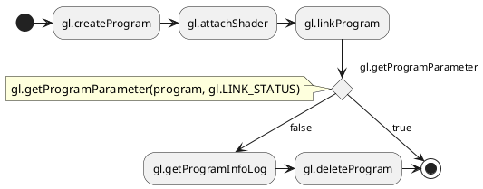
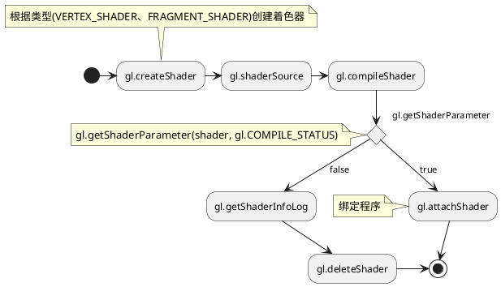
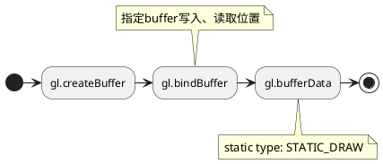
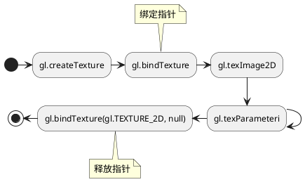



https://cdn.shuey.fun/javascript/2022/0425/gl-matrix-min.js


<meta name="title" value="test"></meta>



  <canvas id="canvas" class="canvas"></canvas>



body {
  overflow: hidden;
  background: var(--theme-background);
}


function canvasResize() {
    let canvasWrapper = document.getElementById('canvas-wrapper');
    let canvasBoundingBox = canvasWrapper.getBoundingClientRect();
    for(let canvas of document.getElementsByClassName('canvas')) {
      canvas.width = Math.floor(canvasBoundingBox.width);
      canvas.height = Math.floor(canvasBoundingBox.width * 8 / 16);
    };
}
window.onresize = canvasResize;
canvasResize();

const canvas = document.querySelector('#canvas');
const prePoint = { x: null, y: null }

let fieldOfView = 45 * Math.PI / 180;   // in radians
const aspect = canvas.clientWidth / canvas.clientHeight;
const zNear = 0.1;
const zFar = 100.0;

let modelX = 0.0;
let modelY = 0.0;
let modelRotateX = 0.0;
let modelRotateY = 0.0;

canvas.addEventListener('contextmenu', e => {
  e.preventDefault();
});

canvas.addEventListener('mousedown', e => {
  prePoint.x = e.offsetX;
  prePoint.y = e.offsetY;
});

canvas.addEventListener('mousemove', e => {
  if (!e.buttons) return;
  const alias = {
    x: e.offsetX - prePoint.x, 
    y: e.offsetY - prePoint.y, 
  }
  switch(e.buttons) {
    case 1: // left button
      const sqr = Math.sqrt(alias.x ** 2 + alias.y ** 2);
      if (sqr) {
        modelRotateX += alias.x / sqr;
        modelRotateY += alias.y / sqr;
      }
      break;
    case 2: // right button
      modelX += alias.x * 0.01;
      modelY -= alias.y * 0.01;
      break;
    case 4: // center button
      fieldOfView = fieldOfView + (alias.y < 0 ? -0.01 : 0.01);
      break;
  }
  prePoint.x = e.offsetX;
  prePoint.y = e.offsetY;
});

main();

function main() {
  const gl = canvas.getContext('webgl2');
  if (!gl) {
    alert('Unable to initialize WebGL. Your browser or machine may not support it.');
    return;
  }
  const vsSource = `
    attribute vec4 aVertexPosition;
    attribute vec3 aVertexNormal;
    attribute vec2 aTextureCoord;
    uniform mat4 uNormalMatrix;
    uniform mat4 uModelViewMatrix;
    uniform mat4 uProjectionMatrix;
    varying highp vec2 vTextureCoord;
    varying highp vec3 vLighting;
    void main(void) {
      gl_Position = uProjectionMatrix * uModelViewMatrix * aVertexPosition;
      vTextureCoord = aTextureCoord;
      // Apply lighting effect
      highp vec3 ambientLight = vec3(0.3, 0.3, 0.3);
      highp vec3 directionalLightColor = vec3(1, 1, 1);
      highp vec3 directionalVector = normalize(vec3(0.85, 0.8, 0.75));
      highp vec4 transformedNormal = uNormalMatrix * vec4(aVertexNormal, 1.0);
      highp float directional = max(dot(transformedNormal.xyz, directionalVector), 0.0);
      vLighting = ambientLight + (directionalLightColor * directional);
    }
  `;
  const fsSource = `
    varying highp vec2 vTextureCoord;
    varying highp vec3 vLighting;
    uniform sampler2D uSampler;
    void main(void) {
      highp vec4 texelColor = texture2D(uSampler, vTextureCoord);
      gl_FragColor = vec4(texelColor.rgb * vLighting, texelColor.a);
    }
  `;
  const shaderProgram = initShaderProgram(gl, vsSource, fsSource);
  const programInfo = {
    program: shaderProgram,
    attribLocations: {
      vertexPosition: gl.getAttribLocation(shaderProgram, 'aVertexPosition'),
      vertexNormal: gl.getAttribLocation(shaderProgram, 'aVertexNormal'),
      textureCoord: gl.getAttribLocation(shaderProgram, 'aTextureCoord'),
    },
    uniformLocations: {
      projectionMatrix: gl.getUniformLocation(shaderProgram, 'uProjectionMatrix'),
      modelViewMatrix: gl.getUniformLocation(shaderProgram, 'uModelViewMatrix'),
      normalMatrix: gl.getUniformLocation(shaderProgram, 'uNormalMatrix'),
      uSampler: gl.getUniformLocation(shaderProgram, 'uSampler'),
    }
  };
  const buffers = initBuffers(gl);
  const texture = loadTexture(gl, 'https://cdn.shuey.fun/images/2022/0425/cube_texture.webp');
  var then = 0;
  function render(now) {
    now *= 0.001;  // convert to seconds
    const deltaTime = now - then;
    then = now;
    drawScene(gl, programInfo, buffers, texture, deltaTime);
    requestAnimationFrame(render);
  }
  requestAnimationFrame(render);
}
function initBuffers(gl) {
  const positionBuffer = gl.createBuffer();
  gl.bindBuffer(gl.ARRAY_BUFFER, positionBuffer);
  const positions = [
    // Front face
    -1.0, -1.0,  1.0,
    1.0, -1.0,  1.0,
    1.0,  1.0,  1.0,
    -1.0,  1.0,  1.0,

    // Back face
    -1.0, -1.0, -1.0,
    -1.0,  1.0, -1.0,
    1.0,  1.0, -1.0,
    1.0, -1.0, -1.0,

    // Top face
    -1.0,  1.0, -1.0,
    -1.0,  1.0,  1.0,
    1.0,  1.0,  1.0,
    1.0,  1.0, -1.0,

    // Bottom face
    -1.0, -1.0, -1.0,
    1.0, -1.0, -1.0,
    1.0, -1.0,  1.0,
    -1.0, -1.0,  1.0,

    // Right face
    1.0, -1.0, -1.0,
    1.0,  1.0, -1.0,
    1.0,  1.0,  1.0,
    1.0, -1.0,  1.0,

    // Left face
    -1.0, -1.0, -1.0,
    -1.0, -1.0,  1.0,
    -1.0,  1.0,  1.0,
    -1.0,  1.0, -1.0,
  ];
  gl.bufferData(gl.ARRAY_BUFFER, new Float32Array(positions), gl.STATIC_DRAW);
  const normalBuffer = gl.createBuffer();
  gl.bindBuffer(gl.ARRAY_BUFFER, normalBuffer);

  const vertexNormals = [
    // Front
    0.0,  0.0,  1.0,
    0.0,  0.0,  1.0,
    0.0,  0.0,  1.0,
    0.0,  0.0,  1.0,

    // Back
    0.0,  0.0, -1.0,
    0.0,  0.0, -1.0,
    0.0,  0.0, -1.0,
    0.0,  0.0, -1.0,

    // Top
    0.0,  1.0,  0.0,
    0.0,  1.0,  0.0,
    0.0,  1.0,  0.0,
    0.0,  1.0,  0.0,

    // Bottom
    0.0, -1.0,  0.0,
    0.0, -1.0,  0.0,
    0.0, -1.0,  0.0,
    0.0, -1.0,  0.0,

    // Right
    1.0,  0.0,  0.0,
    1.0,  0.0,  0.0,
    1.0,  0.0,  0.0,
    1.0,  0.0,  0.0,

    // Left
    -1.0,  0.0,  0.0,
    -1.0,  0.0,  0.0,
    -1.0,  0.0,  0.0,
    -1.0,  0.0,  0.0
  ];

  gl.bufferData(gl.ARRAY_BUFFER, new Float32Array(vertexNormals),
                gl.STATIC_DRAW);
  const textureCoordBuffer = gl.createBuffer();
  gl.bindBuffer(gl.ARRAY_BUFFER, textureCoordBuffer);

  const textureCoordinates = [
    // Front
    0.0,  0.0,
    1.0,  0.0,
    1.0,  1.0,
    0.0,  1.0,
    // Back
    0.0,  0.0,
    1.0,  0.0,
    1.0,  1.0,
    0.0,  1.0,
    // Top
    0.0,  0.0,
    1.0,  0.0,
    1.0,  1.0,
    0.0,  1.0,
    // Bottom
    0.0,  0.0,
    1.0,  0.0,
    1.0,  1.0,
    0.0,  1.0,
    // Right
    0.0,  0.0,
    1.0,  0.0,
    1.0,  1.0,
    0.0,  1.0,
    // Left
    0.0,  0.0,
    1.0,  0.0,
    1.0,  1.0,
    0.0,  1.0,
  ];

  gl.bufferData(gl.ARRAY_BUFFER, new Float32Array(textureCoordinates),
                gl.STATIC_DRAW);
  const indexBuffer = gl.createBuffer();
  gl.bindBuffer(gl.ELEMENT_ARRAY_BUFFER, indexBuffer);
  const indices = [
    0,  1,  2,      0,  2,  3,    // front
    4,  5,  6,      4,  6,  7,    // back
    8,  9,  10,     8,  10, 11,   // top
    12, 13, 14,     12, 14, 15,   // bottom
    16, 17, 18,     16, 18, 19,   // right
    20, 21, 22,     20, 22, 23,   // left
  ];
  gl.bufferData(gl.ELEMENT_ARRAY_BUFFER,
      new Uint16Array(indices), gl.STATIC_DRAW);
  return {
    position: positionBuffer,
    normal: normalBuffer,
    textureCoord: textureCoordBuffer,
    indices: indexBuffer,
  };
}
function loadTexture(gl, url) {
  const texture = gl.createTexture();
  gl.bindTexture(gl.TEXTURE_2D, texture);
  const level = 0;
  const internalFormat = gl.RGBA;
  const width = 1;
  const height = 1;
  const border = 0;
  const srcFormat = gl.RGBA;
  const srcType = gl.UNSIGNED_BYTE;
  const pixel = new Uint8Array([0, 0, 255, 255]);  // opaque blue
  gl.texImage2D(gl.TEXTURE_2D, level, internalFormat,
                width, height, border, srcFormat, srcType,
                pixel);

  const image = new Image();
  image.onload = function() {
    gl.bindTexture(gl.TEXTURE_2D, texture);
    gl.texImage2D(gl.TEXTURE_2D, level, internalFormat,
                  srcFormat, srcType, image);
    if (isPowerOf2(image.width) && isPowerOf2(image.height)) {
      gl.generateMipmap(gl.TEXTURE_2D);
    } else {
      gl.texParameteri(gl.TEXTURE_2D, gl.TEXTURE_WRAP_S, gl.CLAMP_TO_EDGE);
      gl.texParameteri(gl.TEXTURE_2D, gl.TEXTURE_WRAP_T, gl.CLAMP_TO_EDGE);
      gl.texParameteri(gl.TEXTURE_2D, gl.TEXTURE_MIN_FILTER, gl.LINEAR);
    }
  };
  image.crossOrigin = '';
  image.src = url;
  return texture;
}
function isPowerOf2(value) {
  return (value & (value - 1)) == 0;
}
function drawScene(gl, programInfo, buffers, texture, deltaTime) {
  gl.clearColor(0.0, 0.0, 0.0, 1.0);  // Clear to black, fully opaque
  gl.clearDepth(1.0);                 // Clear everything
  gl.enable(gl.DEPTH_TEST);           // Enable depth testing
  gl.depthFunc(gl.LEQUAL);            // Near things obscure far things
  gl.clear(gl.COLOR_BUFFER_BIT | gl.DEPTH_BUFFER_BIT);

  const modelViewMatrix = mat4.create();
  mat4.translate(modelViewMatrix,
                modelViewMatrix,
                [modelX, modelY, -6.0]);
  mat4.rotate(modelViewMatrix,
              modelViewMatrix,
              1,
              [modelRotateX, modelRotateY, 0]);

  const projectionMatrix = mat4.create();
  mat4.perspective(projectionMatrix,
                  fieldOfView,
                  aspect,
                  zNear,
                  zFar);
  const normalMatrix = mat4.create();
  mat4.invert(normalMatrix, modelViewMatrix);
  mat4.transpose(normalMatrix, normalMatrix);
  {
    const numComponents = 3;
    const type = gl.FLOAT;
    const normalize = false;
    const stride = 0;
    const offset = 0;
    gl.bindBuffer(gl.ARRAY_BUFFER, buffers.position);
    gl.vertexAttribPointer(
        programInfo.attribLocations.vertexPosition,
        numComponents,
        type,
        normalize,
        stride,
        offset);
    gl.enableVertexAttribArray(
        programInfo.attribLocations.vertexPosition);
  }
  {
    const numComponents = 2;
    const type = gl.FLOAT;
    const normalize = false;
    const stride = 0;
    const offset = 0;
    gl.bindBuffer(gl.ARRAY_BUFFER, buffers.textureCoord);
    gl.vertexAttribPointer(
        programInfo.attribLocations.textureCoord,
        numComponents,
        type,
        normalize,
        stride,
        offset);
    gl.enableVertexAttribArray(
        programInfo.attribLocations.textureCoord);
  }
  {
    const numComponents = 3;
    const type = gl.FLOAT;
    const normalize = false;
    const stride = 0;
    const offset = 0;
    gl.bindBuffer(gl.ARRAY_BUFFER, buffers.normal);
    gl.vertexAttribPointer(
        programInfo.attribLocations.vertexNormal,
        numComponents,
        type,
        normalize,
        stride,
        offset);
    gl.enableVertexAttribArray(
        programInfo.attribLocations.vertexNormal);
  }
  gl.bindBuffer(gl.ELEMENT_ARRAY_BUFFER, buffers.indices);
  gl.useProgram(programInfo.program);
  gl.uniformMatrix4fv(
      programInfo.uniformLocations.projectionMatrix,
      false,
      projectionMatrix);
  gl.uniformMatrix4fv(
      programInfo.uniformLocations.modelViewMatrix,
      false,
      modelViewMatrix);
  gl.uniformMatrix4fv(
      programInfo.uniformLocations.normalMatrix,
      false,
      normalMatrix);
  gl.activeTexture(gl.TEXTURE0);
  gl.bindTexture(gl.TEXTURE_2D, texture);
  gl.uniform1i(programInfo.uniformLocations.uSampler, 0);
  {
    const vertexCount = 36;
    const type = gl.UNSIGNED_SHORT;
    const offset = 0;
    gl.drawElements(gl.TRIANGLES, vertexCount, type, offset);
  }
}
function initShaderProgram(gl, vsSource, fsSource) {
  const vertexShader = loadShader(gl, gl.VERTEX_SHADER, vsSource);
  const fragmentShader = loadShader(gl, gl.FRAGMENT_SHADER, fsSource);
  const shaderProgram = gl.createProgram();
  gl.attachShader(shaderProgram, vertexShader);
  gl.attachShader(shaderProgram, fragmentShader);
  gl.linkProgram(shaderProgram);
  if (!gl.getProgramParameter(shaderProgram, gl.LINK_STATUS)) {
    console.error('Unable to initialize the shader program: ' + gl.getProgramInfoLog(shaderProgram));
    return null;
  }
  return shaderProgram;
}
function loadShader(gl, type, source) {
  const shader = gl.createShader(type);
  gl.shaderSource(shader, source);
  gl.compileShader(shader);
  if (!gl.getShaderParameter(shader, gl.COMPILE_STATUS)) {
    console.error('An error occurred compiling the shaders: ' + gl.getShaderInfoLog(shader));
    gl.deleteShader(shader);
    return null;
  }
  return shader;
}



## WebGL理解

### 状态

`gl_Position`: 被定义的顶点着色器返回值寄存器。

### 参数

1. 属性(Attributes)，缓冲区(Buffers)和顶点数组(Vetex Arrays)

缓存区以二进制数据形式的数组传给GPU。缓存区可以放任意数据，通常有位置，归一化参数，纹理坐标，顶点颜色等等

属性用来指定数据如何从缓冲区获取并提供给顶点着色器。比如你可能将位置信息以3个32位的浮点数据存在缓存区中， 一个特定的属性包含的信息有：它来自哪个缓存区，它的数据类型(3个32位浮点数据)，在缓存区的起始偏移量，从一个位置到下一个位置有多少个字节等等。

缓冲区并非随机访问的，而是将顶点着色器执行指定次数。每次执行时，都会从每个指定的缓冲区中提取下一个值并分配给一个属性。

属性的状态收集到一个顶点数组对象（VAO）中，该状态作用在每个缓冲区，以及如何从这些缓冲区中提取数据。

2. Uniforms

Uniforms是在执行着色器程序前设置的***全局变量***

3. 纹理(Textures)

纹理是能够在着色器程序中随机访问的数组数据。大多数情况下纹理存储图片数据，但它也用于包含颜色以为的数据。

4. Varyings

Varyings是一种从点着色器到片段着色器传递数据的方法。根据显示的内容如点，线或三角形， 顶点着色器在Varyings中设置的值，在运行片段着色器的时候会被解析。

### 绘制

gl.drawArrays和gl.drawElements将状态绘制到屏幕上。

### 版本

`#version 300 es`: 首行启用WebGL2

## 创建着色器程序。

## 创建着色器

## 创建buffer

代码中多次使用`bindBuffer`，起初阅读代码以为是指定buffer中的数据类型，之后发现在要使用这个数据的时候也需要在这之前调用`bindBuffer`。于是觉得不同的bind类型是不同的数据类型的访问***指针***（参[gl.h][]），在写入`gl.bufferData`和读取`gl.vertexAttribPointer`、`gl.enableVertexAttribArray`之前都需要重新绑定到固定地址。

- `gl.ARRAY_BUFFER`: 包含顶点属性的Buffer，如顶点坐标，纹理坐标数据或顶点颜色数据。
- `gl.ELEMENT_ARRAY_BUFFER`: 用于元素索引的Buffer。
- `gl.COPY_READ_BUFFER`: 从一个Buffer对象复制到另一个Buffer对象。
- `gl.COPY_WRITE_BUFFER`: 从一个Buffer对象复制到另一个Buffer对象。
- `gl.TRANSFORM_FEEDBACK_BUFFER`: Buffer for transform feedback operations.
- `gl.UNIFORM_BUFFER`: 用于存储统一块的Buffer。
- `gl.PIXEL_PACK_BUFFER`: 用于像素传输操作的Buffer。
- `gl.PIXEL_UNPACK_BUFFER`: 用于像素传输操作的Buffer。

## 创建纹理

从这里我就更觉得`bind`相关的操作就是把固定的内存指针指向数据区域，并且对这个区域做出操作。详细的要求参考[MDN WebGL Texture](https://developer.mozilla.org/zh-CN/docs/Web/API/WebGL_API/Tutorial/Using_textures_in_WebGL)。

## 默认操作

vertexAttribPointer

[OpenGL ES]: https://www.khronos.org/registry/OpenGL/index_es.php#specs10 "OpenGL ES 1.0"
[Document]: https://www.khronos.org/registry/OpenGL/specs/es/1.0/opengles_spec_1_0.pdf "OpenGL ES Specific Document"
[gl.h]: https://www.khronos.org/registry/OpenGL/api/GLES/1.0/gl.h "OpenGL Header"
[MDN WebGL API]: https://developer.mozilla.org/en-US/docs/Web/API/WebGL_API "MDN WebGL API"
[WebGL Fundametal]: https://webglfundamentals.org/webgl/lessons/webgl-3d-perspective.html "WebGL Fundametal"
[glmatrix]: https://glmatrix.net/ "GLMatrix"

[^svg]: SVG的className是SVGAnimatedString，而不是DOM元素的string！
