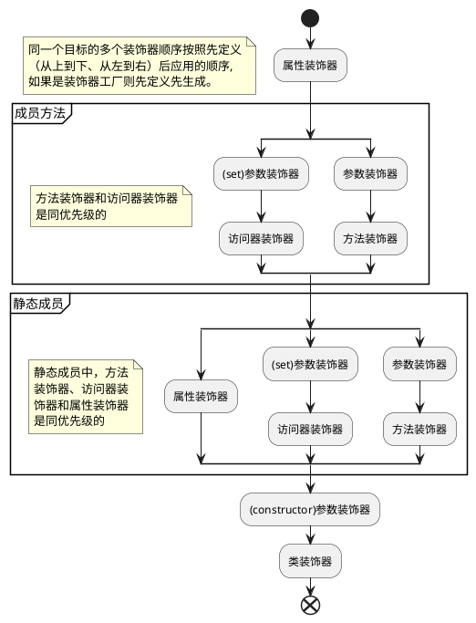

## 装饰器模式

动态地给一个对象添加额外的职责，同时不改变其结构。是比继承更有弹性的替代方案。

> [《Design Patterns: Elements of Reusable Object-Oriented Software》#196](https://store.shuey.fun/ebook/CSBook/%E6%95%B0%E6%8D%AE%E7%BB%93%E6%9E%84%E5%92%8C%E7%AE%97%E6%B3%95/DesignPatterns.pdf)

**优点**

1. 相比较于类的继承来扩展功能，对对象进行包裹更加的灵活;
2. 装饰类和被装饰类相互独立，耦合度较低.

**缺点**

1. 没有继承结构清晰;
2. 层数较多时，难以理解和管理.

### 推荐文章

- [设计模式之装饰器模式（decorator pattern）](https://www.cnblogs.com/yssjun/p/11110013.html)

## TypeScript 中的装饰器

### demo

> 以下为装饰器相关代码，可以在 *⚙ -> JavaScript* 中配置是否启用[实验性装饰器](https://devblogs.microsoft.com/typescript/announcing-typescript-5-0/#decorators)。
>
> 在 *⚙ -> 配置* 中打开Console, 查看执行结果。

{{<playground id="decorator-example" theme="dark" tab="js" tsc="{\"experimentalDecorators\": true, \"emitDecoratorMetadata\": true }" >}}

function classDecorator<T extends { new (...args: any[]): {} }>(constructor: T) {
  console.log('class decorator apply')
}

function functionDecorator(target: any, key: any) {
  console.log('function decorator  apply');
}

function functionDecoratorFactory(name: string) {
  console.log(`function decorator ${name} generate`);
  return function(target: any, key: any) {
    console.log(`function  decorator ${name} apply`);
  }
}

function propertyDecorator(target: any, key: any) {
  console.log('property decorator  apply');
}

function paramsDecorator(target: any, key: any, index: number) {
  console.log('params decorator  apply');
}

function accessorDecorator (target: any, propertyKey: string, descriptor: PropertyDescriptor) {
  console.log('accessor decorator  apply');
};

@classDecorator
class MyClass {
  @propertyDecorator
  public prop1: number = 0;

  constructor(public data: string) {}

  @accessorDecorator
  public get prop() {
    return this.prop1;
  }

  @functionDecoratorFactory('1')
  @functionDecorator
  @functionDecoratorFactory('2')
  public greet(@paramsDecorator a: number): void {}
}

console.log('main');
const instance = new MyClass("Hello");



### 前置知识

#### Descriptor

每个对象都有一组不可见的属性，其中包含于该属性关联的元数据，称为“属性描述符号”。

> [[Web Dev] Property descriptors](https://web.dev/learn/javascript/objects/property-descriptors)
>
> [[MDN] Object.getOwnPropertyDescriptor()](https://developer.mozilla.org/en-US/docs/Web/JavaScript/Reference/Global_Objects/Object/getOwnPropertyDescriptor)


### 代码分析

生成的关键代码（开启实验性装饰器）；

```javascript
"use strict";
var __decorate =
  (this && this.__decorate) ||
  function (decorators, target, key, desc) {
    var argsLength = arguments.length;
    // targetInfo 被装饰器修饰的目标【类或属性或方法或方法参数】
    // argsLength=2 装饰器修饰的是类或者构造器参数，targetInfo=target【类名】
    // argsLength=4 装饰器修饰的是方法【第四个参数desc等于null】
    //   targetInfo=该方法的数据属性【desc = Object.getOwnPropertyDescriptor(target, key)】
    // argsLength=3 装饰器修饰的是方法参数或者属性,targetInfo=undefined
    var targetInfo =
      argsLength < 3
        ? target
        : desc === null
        ? (desc = Object.getOwnPropertyDescriptor(target, key))
        : desc;
    // decorator保存装饰器数组元素
    var decorator;
    if (typeof Reflect === "object" && typeof Reflect.decorate === "function") {
      targetInfo = Reflect.decorate(decorators, target, key, desc);
    } else {
      // 以声明相反顺序应用
      for (var i = decorators.length - 1; i >= 0; i--)
        if ((decorator = decorators[i]))
          targetInfo =
            (argsLength < 3
              ? decorator(targetInfo)
              : argsLength > 3
              ? decorator(target, key, targetInfo)
              : decorator(target, key)) || targetInfo;
    }
    return (
      argsLength > 3 &&
        targetInfo &&
        Object.defineProperty(target, key, targetInfo),
      targetInfo
    );
  };
var __param =
  (this && this.__param) ||
  function (paramIndex, decorator) {
    return function (target, key) {
      decorator(target, key, paramIndex);
    };
  };
```

> 代码注释摘自[深入浅出Typescript装饰器与Reflect元数据](https://juejin.cn/post/7212996764387377209)

```javascript
__decorate([
  // 先通过工厂函数生成所有的装饰器
  functionDecoratorFactory('1'),
  functionDecorator,
  functionDecoratorFactory('2'),
], MyClass.prototype, "greet", null);
```

### 执行顺序



> *同名访问器的装饰器，不允许使用相同的装饰器分别修饰*，详情见[Accessor Decorators](https://www.typescriptlang.org/docs/handbook/decorators.html#accessor-decorators);
>
> 如果启用了`emitDecoratorMetadata`, `Metadata`的应用时机在用户装饰器之前。所以用户装饰器可以安全的访问`design:type`, `design:paramtypes`, `design:returntype`等信息，详情见[reflect-metadata](https://github.com/rbuckton/reflect-metadata)[^reflect]。

### 推荐文章

- [TS装饰器完全指南](https://mirone.me/a-complete-guide-to-typescript-decorator/)
- [TS handbook 装饰器](https://www.typescriptlang.org/docs/handbook/decorators.html)
- [编写类型友好的装饰器](https://devblogs.microsoft.com/typescript/announcing-typescript-5-0/#writing-well-typed-decorators)

[^reflect]: 对当前的[Reflect](https://developer.mozilla.org/en-US/docs/Web/JavaScript/Reference/Global_Objects/Reflect)的扩充。