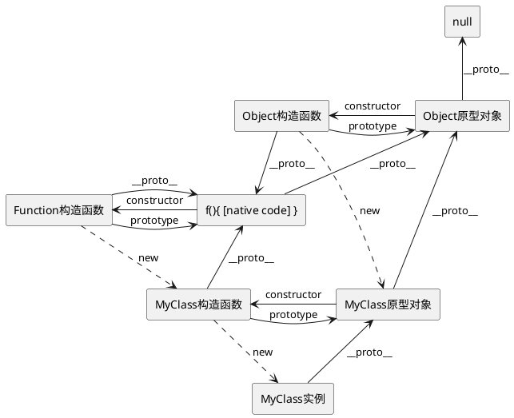
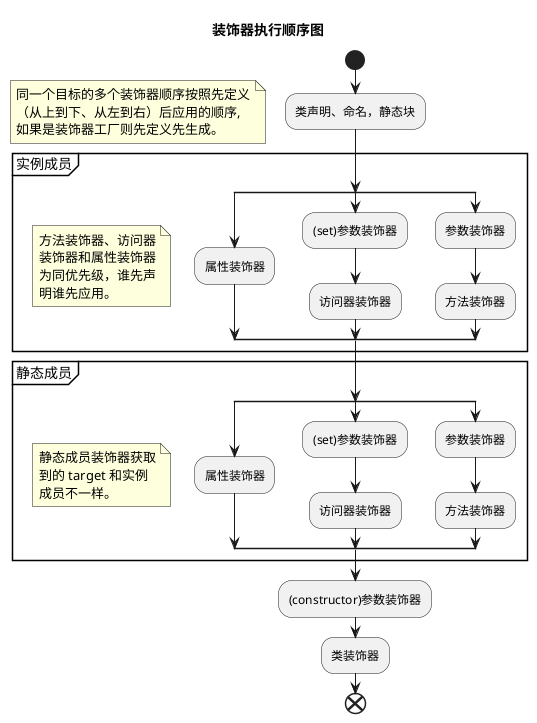

## 装饰模式

先简单介绍一下装饰模式：动态地给一个对象添加额外的职责，同时不改变其结构。是比继承更有弹性的替代方案。

> [《Design Patterns: Elements of Reusable Object-Oriented Software》#196](https://store.shuey.fun/ebook/CSBook/%E6%95%B0%E6%8D%AE%E7%BB%93%E6%9E%84%E5%92%8C%E7%AE%97%E6%B3%95/DesignPatterns.pdf)

> 举个🌰，一个人，可以在冬天的时穿羽绒服，也可以在下雨天套上雨衣。所有这些外在的服装并没有改变人的本质，但是它们却拓展了人的基本抗性。——[一起读透TS装饰器](https://juejin.cn/post/7004035071459983390)

**优点**

1. 相比较于类的继承来扩展功能，对对象进行包裹更加的灵活。
2. 装饰类和被装饰类相互独立，耦合度较低。

**缺点**

1. 没有继承结构清晰。
2. 层数较多时，难以理解和管理。


### 推荐文章

- [设计模式之装饰器模式（decorator pattern）](https://www.cnblogs.com/yssjun/p/11110013.html)

## TS 中的装饰器[^experimental]


以下所有内容均使用旧版本装饰器！！！


装饰器可以修改类的行为， 常用于[元编程](https://en.wikipedia.org/wiki/Metaprogramming)和代码复用。

### 装饰器语法

装饰器是一种特殊类型的声明，本质上是一个普通的函数，通过语法 `@Decorator` 加到类、方法、访问器、属性或参数上。

装饰器的基本语法如下：

```typescript
@decorator
class MyClass {
  // ...
}
```

装饰器函数的定义如下：

```typescript
function decorator(target: any, propertyKey?: string, descriptor?: PropertyDescriptor) {
  // 装饰器逻辑
}
```

### 装饰器的类型

装饰器类型定义，详见 [decorators.legacy.d.ts](https://github.com/microsoft/TypeScript/blob/v5.6.3/src/lib/decorators.legacy.d.ts);

```typescript
// 类装饰器
declare type ClassDecorator = <TFunction extends Function>(target: TFunction) => TFunction | void;
// 属性装饰器
declare type PropertyDecorator = (target: Object, propertyKey: string | symbol) => void;
// 方法/访问器装饰器
declare type MethodDecorator = <T>(
  target: Object,
  propertyKey: string | symbol,
  descriptor: TypedPropertyDescriptor<T>
) => TypedPropertyDescriptor<T> | void;
// 参数装饰器
declare type ParameterDecorator = (
  target: Object,
  propertyKey: string | symbol | undefined,
  parameterIndex: number
) => void;
```

#### 类装饰器

类装饰器应用于类构造函数，可以用来监视、修改或替换类定义。

**参数**：仅接受一个参数，即类的构造函数。

**返回值**：如果返回非空则替换原来的类。


如果返回了一个和被装饰类毫无关系的类怎么办！！乱棍打死💢～


***如上述tips所言，TS无法为装饰器提供类型保护。***

```typescript
// 使得类构造函数、原型不允许再被修改
function sealed(constructor: Function) {
    Object.seal(constructor);
    Object.seal(constructor.prototype);
}

@sealed
class Greeter {
    greeting: string;
    constructor(message: string) {
        this.greeting = message;
    }
    greet() {
        return "Hello, " + this.greeting;
    }
}
```

#### 方法装饰器

方法装饰器应用于方法，可以用来监视、修改或替换方法定义。

**参数**

- `target`: 原型对象，修饰静态成员时则为构造函数
- `propertyKey`: 方法名
- `descriptor`: 方法的描述符。

**返回值**：如果返回了一个非空的值`result`，则会调用`Object.defineProperty(target, result)`。

```typescript
function timeLog(
  target: Object,
  propertyKey: string | symbol,
  descriptor: PropertyDescriptor
) {
  const originalMethod = descriptor.value! as unknown as Function;

  descriptor.value = function (...args: any[]) {
    const start = performance.now();
    const result = originalMethod.apply(target, args);
    Promise.resolve(result).then(() => {
      const executionTime = performance.now() - start;
      console.log(`Method executed in ${executionTime}ms`);
    });
    return result;
  };
  return descriptor;
};

class HeavyTask {
  @timeLog
  calculate() {
    let result = 1;
    for (let index = 0; index < 1_000_000; index++) {
      result ++;
    }
  }
}
```

#### 访问器装饰器

访问器装饰器本质上就是方法装饰器，不同的地方在于第三个参数`属性描述符上`。


> *同名访问器不允许使用相同的装饰器分别修饰*，详情见 [Accessor Decorators](https://www.typescriptlang.org/docs/handbook/decorators.html#accessor-decorators);

可以看到访问器装饰器的描述符中同时有 `getter` 和 `setter`，如果都应用相同的装饰器，会出现装饰多次，显然是错误的——好比我穿了一件羽绒服，然后又穿了一件相同的羽绒服。

#### 属性装饰器

属性装饰器应用于类的属性，可以用来修改属性的元数据。由于运行装饰器的时候，类还没有实例化，如果我们严格按照定义使用，属性装饰器只能收集信息！但是结合下面说的 **返回值 *bug(feature?)*** 还是可以实现很多好玩的功能。

**参数**

- `target`: 原型对象，修饰静态成员时则为构造函数
- `propertyKey`: 属性名
- ~~`descriptor`: 属性描述符（由于实例没有初始化，没有办法获取到属性描述符，会得到undefined）。~~ 

> 虽然 `TS` 定义中不存在，但转译到 `JS` 却有传参，不可以通过判断参数长度来区分属性装饰器和方法装饰器。

**返回值**：~~如果返回了一个非空的值`result`，则会调用`Object.defineProperty(target, result)`。~~

> 虽然 `TS` 定义中不使用返回值，但转译到 `JS` 的时候返回值会和[方法装饰器]()一样处理。

#### 参数装饰器

参数装饰器应用于方法参数，可以用来修改参数的元数据。

> 不使用骚操作（使用方法名获取到方法，然后修改原型或构造函数上的方法）的话，大概就只能信息收集！

**参数**

- `target`: 原型对象，修饰静态方法参数时则为构造函数
- `propertyKey`: 参数所在的方法名
- `parameterIndex`: 该参数在入参中的索引

## TS 装饰器详情

### 前置知识

#### Descriptor

每个对象都有一组不可见的属性，其中包含于该属性关联的元数据，称为“描述符”。`Descriptor` 包含以下属性：

| 属性          | 描述                                                      | 默认值    |
|---------------|----------------------------------------------------------|---------------|
| `value`       | 与属性关联的值（仅限数据描述符）。                             | **undefined** |
| `writable`    | 布尔值，属性值是否可以更改（仅限数据描述符）。                   | **false**     |
| `get`         | 与属性关联的 getter 函数，没有则为 undefined（仅限访问器描述符）。| **undefined** |
| `set`         | 与属性关联的 setter 函数，没有则为 undefined（仅限访问器描述符）。| **undefined** |
| `configurable`| 布尔值，表示属性的描述符是否可以更改（writable 为 true 时，属性值可以被修改，且 writable 可以被修改为 false）或属性是否可以被删除。                           | **false**     |
| `enumerable`  | 布尔值，表示访问器是否可以被枚举。                             | **false**     |

> [[Web Dev] Property descriptors](https://web.dev/learn/javascript/objects/property-descriptors)
>
> [[MDN] Object.getOwnPropertyDescriptor()](https://developer.mozilla.org/en-US/docs/Web/JavaScript/Reference/Global_Objects/Object/getOwnPropertyDescriptor)
>
> [[MDN] Object.defineProperty()](https://developer.mozilla.org/en-US/docs/Web/JavaScript/Reference/Global_Objects/Object/defineProperty)

#### 原型链

属性装饰器、访问器装饰器、方法装饰器传入的 `target` 参数，在静态成员下，是类构造函数，普通则为类的原型。当使用装饰器对类作骚操作的时候就需要注意当前的修改对象是谁以及如何生效。

在 JavaScript 中，原型链（prototype chain）是对象属性继承的一种机制。每个 JavaScript 对象（除了 __null__ 之外）都有一个与之关联的原型对象，当你试图访问对象的某个属性时，JavaScript 会首先检查该对象本身是否拥有这个属性。如果没有，它会顺着原型链往上查找，直到找到这个属性或到达 __null__（表示链的尽头）。

##### 原型链的结构

- 每个对象都有一个特殊的属性 __\_\_proto\_\___，指向它的原型对象（prototype）。注意 __\_\_proto\_\___ 是实现中的一个内部属性，而 __prototype__ 是函数对象特有的属性。
- 一个对象的原型对象又有它自己的原型对象，这样就形成了一条链，称为原型链。



> 逐步验证上图：[详解 prototype 与 \_\_proto\_\_](https://louiszhai.github.io/2015/12/17/prototype/)
>
> JSObject以及JSFunction的关系可以参考[（更新）从 Chrome 源码看 JS Object 的实现](https://zhuanlan.zhihu.com/p/26169639) 中的插图.

好的，现在我们已经知道 *1 + 1 = 2*，接下来我们来解方程吧！

```javascript
const obj = {}; // 如果更换为 Object.create(null)，结果是啥？
const prototype = (obj.__proto__ = Object.defineProperty({ a: 1 }, 'b', {
  configurable: false,
  value: 2,
}));
// 输出啥？
console.log(obj.a, (obj.a = 10), obj.a, prototype.a);
console.log(obj.b, (obj.b = 20), obj.b, prototype.b);
```

### demo

> 在 *⚙ -> 配置* 中打开Console, 查看执行结果。

{{<playground id="decorator-example" theme="dark" tab="js" tsc="{\"experimentalDecorators\": true, \"emitDecoratorMetadata\": true }" >}}

// 类型不友好，仅供时序测试
function decoratorFactory(name: string) {
  console.log(`${name} decorator generate`);
  return (function() {
    console.log(`${name} decorator apply`);
  } as any)
}
const functionDecorator = decoratorFactory('func');

@decoratorFactory('class')
class MyClass {
  static {
    console.log("static block")
  }

  @decoratorFactory('static property')
  public static PROPS: number = 1;
 
  @decoratorFactory('property')
  public prop1: number = 0;

  constructor(public data: string) {}

  @decoratorFactory('accessor')
  public get prop() {
    return this.prop1;
  }

  @decoratorFactory('func1')
  @functionDecorator
  @decoratorFactory('func2')
  public greet(@decoratorFactory('params') a: number): void {}
}

console.log('main');
const instance = new MyClass("Hello");



### 代码分析

生成的关键代码（代码简化后）；

```javascript
function __decorate(decorators, target, key, desc) {
  // arguments.length 小于3是属性类装饰器, 其他均为4
  const isClassDecorator = arguments.length < 3;
  let targetInfo = isClassDecorator
    ? target
    : desc === null
    ? (desc = Object.getOwnPropertyDescriptor(target, key))
    : desc;
  // decorator保存装饰器数组元素
  let decorator;
  // 以声明相反顺序应用
  for (let i = decorators.length - 1; i >= 0; i--)
    if ((decorator = decorators[i]))
      // 如果返回新的了描述符/类, 则替换
      targetInfo =
        (isClassDecorator
          ? decorator(targetInfo)
          : decorator(target, key, targetInfo)) || targetInfo;
  return (
    !isClassDecorator &&
      targetInfo &&
      Object.defineProperty(target, key, targetInfo),
    targetInfo
  );
}
// 将参数装饰器封装为方法装饰器
function __param(paramIndex, decorator) {
  return function (target, key) {
    decorator(target, key, paramIndex);
  };
}

__decorate([
  // 先通过工厂函数生成所有的装饰器
  decoratorFactory('func1'),
  functionDecorator,
  decoratorFactory('func2'),
], MyClass.prototype, "greet", null);
```

### 执行顺序

装饰器的执行分为两个阶段。

（1）评估（evaluation）：计算@符号后面的表达式的值，得到的应该是函数。

（2）应用（application）：将评估装饰器后得到的函数，应用于所装饰对象。

这版本装饰器的**评估**和**应用**时先后一起发生的。



> [TypeScript Handbook 装饰器应用顺序](https://www.typescriptlang.org/docs/handbook/decorators.html#decorator-evaluation)。对于装饰器工厂，装饰器在对应装饰器被使用前生成（**无间隔**）。如果对具体源码感兴趣，可以查看对应内容：
> 
> - 装饰器编译 [TypeScript源码v5.6.3, legacyDecorators](https://github.com/microsoft/TypeScript/blob/v5.6.3/src/compiler/transformers/legacyDecorators.ts);
> - 函数及参数装饰器执行顺序[源码](https://github.com/microsoft/TypeScript/blob/v5.6.3/src/compiler/transformers/legacyDecorators.ts#L532)
> - 静态成员和实例成员执行顺序[源码](https://github.com/microsoft/TypeScript/blob/v5.6.3/src/compiler/transformers/legacyDecorators.ts#L183)

> 如果启用了 `emitDecoratorMetadata`, `Metadata` 应用时机在用户装饰器之前。所以用户装饰器可以安全的访问 `design:type`, `design:paramtypes`, `design:returntype` 等信息，详情见 [reflect-metadata](https://github.com/rbuckton/reflect-metadata)[^reflect].

### 推荐文章

- [TS 装饰器完全指南](https://mirone.me/a-complete-guide-to-typescript-decorator/)
- [TS handbook 装饰器](https://www.typescriptlang.org/docs/handbook/decorators.html)

## TS 装饰器应用

**纸上得来终觉浅，绝知此事要躬行**

### 功能增加（如日志、路由）

首先我们简单的创建一个 http 服务，同时声明好路由控制器。

```typescript {hl_lines=["4-5"]}
import * as http from "http";
import { default as Router } from "router";
import finalhandler from "finalhandler";
/// <reference path="reflect-metadata/standalone.d.ts" />
import "reflect-metadata";

const router = new Router();
http
  .createServer((req, res) => router(req, res, finalhandler(req, res)))
  .listen(8080);
```
分别实现方法装饰器、类装饰器。

- **AllMethod**：作用是允许任意方法请求该二级路由，实际开发中可以用工厂创建，同时将请求方法和路由一起存入 `metaData`。

- **Controller**：由于类装饰器最后运行，因此我们可以拿到方法上保存的 `metaData`，并增加统一的路由前缀后注册到路由控制器上。

```typescript {linenostart=12}
const pathSymbol = Symbol("path");

function controller(path: string): ClassDecorator {
  return function (target: any) {
    for (const handlerName in target.prototype) {
      const childPath = Reflect.getMetadata(
        pathSymbol,
        target.prototype,
        handlerName
      );
      const handler = target.prototype[handlerName];
      router.use(`${path}${childPath}`, handler);
    }
  };
}

function allMethod(path: string): MethodDecorator {
  return function (
    targetPrototype: Object,
    propertyKey: string | symbol,
    descriptor: TypedPropertyDescriptor<any>
  ) {
    Reflect.defineMetadata(pathSymbol, path, targetPrototype, propertyKey);
  };
}
```

最后编写我们的用户控制器类，分别注册 `GET /user/query/:id` 以及 `GET /user/exists/:name` 俩个接口。

```typescript {linenostart=58}
@controller("/user")
class UserController {
  @allMethod("/query/:id")
  public getById(
    req: http.IncomingMessage & { params: Record<string, string> },
    res: http.ServerResponse<http.IncomingMessage>
  ) {
    res.end(`${req.method} ${req.params.id}`, "utf-8");
  }

  @allMethod("/exists/:name")
  public queryIsTargetExisted(
    req: http.IncomingMessage & { params: Record<string, string> },
    res: http.ServerResponse<http.IncomingMessage>
  ) {
    res.end(`${req.params.name} already exists;`, "utf-8");
  }
}
```

按照上述的代码即可编写简单一个简单的服务框架啦。也可以用上述方式配合 [express](https://github.com/expressjs/express)等框架啦。

> 代码依赖 [router](https://github.com/pillarjs/router)、[reflect-metadata](https://github.com/rbuckton/reflect-metadata)。

`VS Code` 中的 [git extension](https://github.com/microsoft/vscode/blob/1.94.1/extensions/git/src/commands.ts#L287) 也采用类似的方法装饰器实现注册多个`command`。方法装饰器还可以实现如下功能：

1. 返回值缓存
2. 参数校验
3. 权限控制
4. ...

### DI（依赖注入）[^SOLID]

如何实现依赖注入？其实就是解决俩个主要问题，“依赖什么”以及“如何找到依赖”。不同于 `Java` 有内置的查询所有类的方法，在 `TS` 中我们需要自己实现一个全局的单例作为容器，并给依赖一个键，这样就解决了“如何找到依赖”的问题。“依赖什么”只需要在使用的时候指定前面说的键即可。

实现依赖注入需要解决很多细节上问题，例如循环依赖。本文只展示技术应用，不做完整的校验。

> 私推荐一下 VSCode 的依赖注入方式[源码](https://github.com/microsoft/vscode/blob/1.94.1/src/vs/platform/instantiation/common/instantiation.ts)，以及别人写的解读博客 [VSCode For Web 深入浅出 -- 依赖注入设计](https://juejin.cn/post/7166143245851115550)、[详解依赖注入的原理与实现](https://aaaaash.notion.site/e5674b99d1b5480988a1b3b2bdf52370)。

```typescript
type Constructor<T = any> = new (...args: any[]) => T;
const container = {
  map: new Map<string | symbol, Constructor>(),
  instantiate(key: string | symbol) {
    const constructor = this.map.get(key);
    if (!constructor) throw new Error("依赖未注册");
    return new constructor();
  }
}

function inject(key: string | symbol): ClassDecorator {
  return function (target: any) {
    container.map.set(key, target);
  };
}

function injected(key: string): PropertyDecorator {
  return function (target: any, propertyKey: string | symbol) {
    const privateKey = Symbol(propertyKey.toString());
    return ({
      get(this: any) {
        // 惰性初始化
        return (this[privateKey] ??= container.instantiate(key));
      },
      set(this: any, value: any) {
        this[privateKey] = value;
      },
      enumerable: true,
      configurable: true,
    });
  };
}
```

- **@inject**：装饰器用于将类注册到容器中。
- **@injected**：装饰器用于从容器中获取依赖并注入到类的属性中。

推荐博文的结尾也有一个简单的依赖注入的实现，和上述实现在属性装饰器部分有区别。一个是注入对象立即绑定到原型上，所有实例共享一个依赖；一个是使用时绑定到实例上，每个实例一个不同的依赖。实际开发中一般俩个都可能是合理的场景！

```typescript {linenostart=33}
interface IService { write(name: string): void; };
@inject("IService")
class AService implements IService {
  write(name: string) {
    console.log(name);
  }
}

class InjectTest {
  @injected("IService")
  private readonly service: IService = null!;

  doSomething() {
    this.service.write('hello world');
  }
}

const test = new InjectTest();
test.doSomething();
```

我们首先定义了一个 `IService` 接口，它包含一个 `write` 方法。之所以抽象接口出来，是为了减少被注入类和服务类具体实现之间的耦合。

接下来，我们定义了一个 `AService` 类，它实现了 `IService` 接口。我们使用 `@inject("IService")` 装饰器将 `AService` 类注册为 `IService` 的实现。最后使用 `@injected("IService")` 装饰器将 `IService` 的实例注入到 `service` 属性中。

#### 构造函数注入 vs 属性注入

从依赖注入的角度来看，主要有两种方式：构造函数注入和属性注入。构造函数注入通过构造函数参数装饰器实现依赖收集，然后在实例化服务时进行注入；而属性注入则是直接将依赖注入到类的属性中。

私更喜欢构造函数注入的方式，下面简单介绍一下它相对于属性注入的优缺点。

***优点***：

- **增加明确依赖** ：阅读代码时，可以快速从构造函数中看到当前类完成职能依赖的其他对象，依赖关系更加集中、明确。
- **`bad smell`[^bad] 明确** ：当构造函数参数越来越多的时候，应该考虑当前类是否违反【单一职责】[^SOLID]！
- **初始化流程更合理** ：在当前类初始化之前需要初始化依赖对象，好比穿衣服之前需要先有衣服。
- **性能更佳** ：参数注入不依赖原型进行，访问以及初始化速度更好。[本篇所写属性注入对比参数注入 benchmark](https://tinyurl.com/kxhj2z64)。
- **方便测试** ：使用参数装饰器可以使得类测试可以脱离框架，模拟参数传入即可。
- **注入的后处理** ：可以在构造函数内编写注入对象的后处理，例如轮胎传入之后检查轮胎的动平衡。可以看看 [VSCode ExtensionService](https://github.com/microsoft/vscode/blob/release/1.94/src/vs/workbench/services/extensions/common/abstractExtensionService.ts#L122)。
- **减少多构造函数** ：在 `TypeScript` 中没有真正的多构造函数，同时**不方便**在构造函数注入的场景中使用多构造函数。当多个构造函数设计出现的时候，应该考虑当前类是否违反【单一职责】。
- **依赖固定** ：如果时通过属性注入的方式，注入的对象可以被装饰器内的逻辑动态改变。参数装饰器则在创建的那一刻就固定（这个优缺点因人而异）。

***缺点***：

- **构造函数参数过多** ：`bad smell`是优点也是缺点，实际需求中确实会出现构造函数过多且不方便拆分。参考 [VSCode AbstractTaskService](https://github.com/microsoft/vscode/blob/release/1.94/src/vs/workbench/contrib/tasks/browser/abstractTaskService.ts#L241) 代码，足有36个参数！
- **继承和扩展困难** ：继承需要增加维护依赖的逻辑。参考 [VSCode TaskService](https://github.com/microsoft/vscode/blob/release/1.94/src/vs/workbench/contrib/tasks/electron-sandbox/taskService.ts#L59)，为了增加一行销毁逻辑，写了一百多行代码。
- **参数不可选** ：同【减少多构造函数】一样，也**不方便**实现构造参数可选这一点。

## 参考文献

- [TypeScript 装饰器完全指南](https://mirone.me/zh-hans/a-complete-guide-to-typescript-decorator/)
- [一起读透 TS 装饰器](https://juejin.cn/post/7004035071459983390)
- [深入理解 Typescript 装饰器](https://3rcd.com/blog/ts-decorator)

[^experimental]: 本文主要介绍旧版本装饰器，需启用 `experimentalDecorators`。
[^reflect]: 对当前的 [Reflect](https://developer.mozilla.org/en-US/docs/Web/JavaScript/Reference/Global_Objects/Reflect) 的扩充，用来添加元数据，实现元编程。
[^bad]: 代码异味，可以从这篇文章 [Refactoring / Code Smells](https://refactoringguru.cn/refactoring/smells) 看看还有哪些案例。
[^SOLID]: SOLID (面向对象设计)：单一功能、开闭原则、里氏替换、接口隔离以及依赖反转。