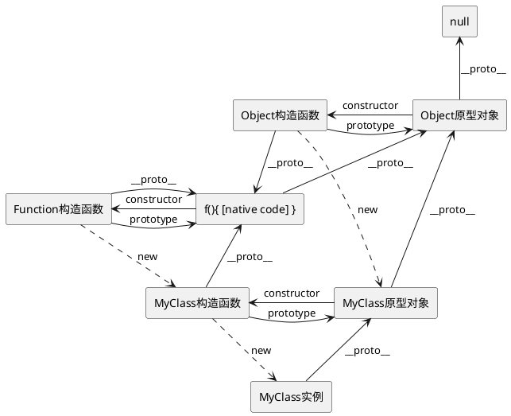
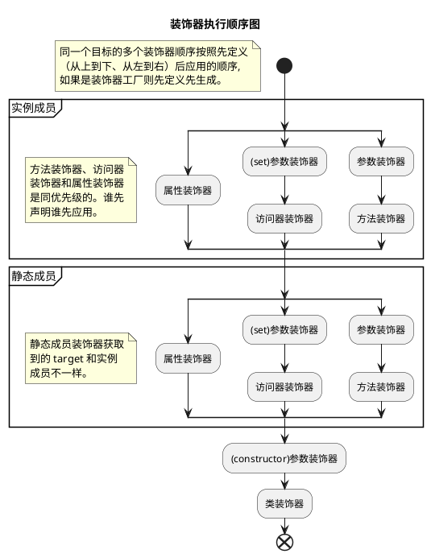

## 装饰器模式

动态地给一个对象添加额外的职责，同时不改变其结构。是比继承更有弹性的替代方案。

> [《Design Patterns: Elements of Reusable Object-Oriented Software》#196](https://store.shuey.fun/ebook/CSBook/%E6%95%B0%E6%8D%AE%E7%BB%93%E6%9E%84%E5%92%8C%E7%AE%97%E6%B3%95/DesignPatterns.pdf)

**优点**

1. 相比较于类的继承来扩展功能，对对象进行包裹更加的灵活;
2. 装饰类和被装饰类相互独立，耦合度较低.

**缺点**

1. 没有继承结构清晰;
2. 层数较多时，难以理解和管理.

### 推荐文章

- [设计模式之装饰器模式（decorator pattern）](https://www.cnblogs.com/yssjun/p/11110013.html)

## TypeScript 中的装饰器

### 前置知识

#### Descriptor

每个对象都有一组不可见的属性，其中包含于该属性关联的元数据，称为“属性描述符号”。

> [[Web Dev] Property descriptors](https://web.dev/learn/javascript/objects/property-descriptors)
>
> [[MDN] Object.getOwnPropertyDescriptor()](https://developer.mozilla.org/en-US/docs/Web/JavaScript/Reference/Global_Objects/Object/getOwnPropertyDescriptor)

#### 原型链

在 JavaScript 中，原型链（prototype chain）是对象属性继承的一种机制。每个 JavaScript 对象（除了 __null__ 之外）都有一个与之关联的原型对象，当你试图访问对象的某个属性时，JavaScript 会首先检查该对象本身是否拥有这个属性。如果没有，它会顺着原型链往上查找，直到找到这个属性或到达 __null__（表示链的尽头）。

##### 原型链的结构

- 每个对象都有一个特殊的属性 __\_\_proto\_\___，指向它的原型对象（prototype）。注意 __\_\_proto\_\___ 是实现中的一个内部属性，而 prototype 是函数对象特有的属性。
- 一个对象的原型对象又有它自己的原型对象，这样就形成了一条链，称为原型链。
- 当试图访问一个对象的属性时，JavaScript 引擎会首先在对象自身查找该属性。如果找不到，它会沿着原型链向上查找。



> 逐步验证上图：[详解prototype与__proto__](https://louiszhai.github.io/2015/12/17/prototype/)
>
> JSObject以及JSFunction的关系可以参考[（更新）从Chrome源码看JS Object的实现](https://zhuanlan.zhihu.com/p/26169639)中的插图.

### demo

> 在 *⚙ -> 配置* 中打开Console, 查看执行结果。
>
> ~~以下为装饰器相关代码，可以在 *⚙ -> JavaScript* 中配置是否启用[实验性装饰器](https://devblogs.microsoft.com/typescript/announcing-typescript-5-0/#decorators)。~~

{{<playground id="decorator-example" theme="dark" tab="js" tsc="{\"experimentalDecorators\": true, \"emitDecoratorMetadata\": true }" >}}

// 类型不友好，仅供时序测试
function decoratorFactory(name: string) {
  console.log(`${name} decorator generate`);
  return (function() {
    console.log(`${name} decorator apply`);
  } as any)
}
const functionDecorator = decoratorFactory('func');

@decoratorFactory('class')
class MyClass {
  @decoratorFactory('static property')
  public static PROPS: number = 1;
 
  @decoratorFactory('property')
  public prop1: number = 0;

  constructor(public data: string) {}

  @decoratorFactory('accessor')
  public get prop() {
    return this.prop1;
  }

  @decoratorFactory('func1')
  @functionDecorator
  @decoratorFactory('func2')
  public greet(@decoratorFactory('params') a: number): void {}
}

console.log('main');
const instance = new MyClass("Hello");



### 代码分析

生成的关键代码（开启实验性装饰器）；

```javascript
"use strict";
var __decorate =
  (this && this.__decorate) ||
  function (decorators, target, key, desc) {
    var argsLength = arguments.length;
    // targetInfo 被装饰器修饰的目标【类或属性或方法或方法参数】
    // argsLength=2 装饰器修饰的是类或者构造器参数，targetInfo=target【类名】
    // argsLength=4 装饰器修饰的是方法【第四个参数desc等于null】
    //   targetInfo=该方法的数据属性【desc = Object.getOwnPropertyDescriptor(target, key)】
    // argsLength=3 装饰器修饰的是方法参数或者属性,targetInfo=undefined
    var targetInfo =
      argsLength < 3
        ? target
        : desc === null
        ? (desc = Object.getOwnPropertyDescriptor(target, key))
        : desc;
    // decorator保存装饰器数组元素
    var decorator;
    if (typeof Reflect === "object" && typeof Reflect.decorate === "function") {
      targetInfo = Reflect.decorate(decorators, target, key, desc);
    } else {
      // 以声明相反顺序应用
      for (var i = decorators.length - 1; i >= 0; i--)
        if ((decorator = decorators[i]))
          targetInfo =
            (argsLength < 3
              ? decorator(targetInfo)
              : argsLength > 3
              ? decorator(target, key, targetInfo)
              : decorator(target, key)) || targetInfo;
    }
    return (
      argsLength > 3 &&
        targetInfo &&
        Object.defineProperty(target, key, targetInfo),
      targetInfo
    );
  };
var __param =
  (this && this.__param) ||
  function (paramIndex, decorator) {
    return function (target, key) {
      decorator(target, key, paramIndex);
    };
  };
```

> 代码注释摘自[深入浅出Typescript装饰器与Reflect元数据](https://juejin.cn/post/7212996764387377209)

```javascript
__decorate([
  // 先通过工厂函数生成所有的装饰器
  decoratorFactory('func1'),
  functionDecorator,
  decoratorFactory('func2'),
], MyClass.prototype, "greet", null);
```

### 执行顺序



> 以上过程是根据编译结果推测执行顺序，详情可以查看[TypeScript源码v5.6.3, legacyDecorators](https://github.com/microsoft/TypeScript/blob/d48a5cf89a62a62d6c6ed53ffa18f070d9458b85/src/compiler/transformers/legacyDecorators.ts);
>
> - 函数及参数装饰器执行顺序[源码](https://github.com/microsoft/TypeScript/blob/d48a5cf89a62a62d6c6ed53ffa18f070d9458b85/src/compiler/transformers/legacyDecorators.ts#L532)
> - 静态成员和实例成员执行顺序[源码](https://github.com/microsoft/TypeScript/blob/d48a5cf89a62a62d6c6ed53ffa18f070d9458b85/src/compiler/transformers/legacyDecorators.ts#L183)

> *同名访问器的装饰器，不允许使用相同的装饰器分别修饰*，详情见[Accessor Decorators](https://www.typescriptlang.org/docs/handbook/decorators.html#accessor-decorators);

> 如果启用了`emitDecoratorMetadata`, `Metadata`应用时机在用户装饰器之前。所以用户装饰器可以安全的访问`design:type`, `design:paramtypes`, `design:returntype`等信息，详情见[reflect-metadata](https://github.com/rbuckton/reflect-metadata)[^reflect].

### 推荐文章

- [TS装饰器完全指南](https://mirone.me/a-complete-guide-to-typescript-decorator/)
- [TS handbook 装饰器](https://www.typescriptlang.org/docs/handbook/decorators.html)
- [编写类型友好的装饰器](https://devblogs.microsoft.com/typescript/announcing-typescript-5-0/#writing-well-typed-decorators)

## TS装饰器应用

**纸上得来终觉浅，绝知此事要躬行**

### 功能增加（如日志）

首先我们简单的创建一个http服务，同时声明好路由控制器。


import * as http from "http";
import { default as Router } from "router";
import finalhandler from "finalhandler";
/// <reference path="reflect-metadata/standalone.d.ts" />
import "reflect-metadata";

const router = new Router();
http
  .createServer((req, res) => router(req, res, finalhandler(req, res)))
  .listen(8080);


分别实现方法装饰器、类装饰器。

- **TimeLog**：在原有的方法上包装一层，打印函数的运行时间，实际开发中需要考虑函数的异步以及其他回调方式。

- **AllMethod**：作用是允许任意方法请求该二级路由，实际开发中可以用工厂创建，同时将请求方法和路由一起存入`metaData`。

- **Controller**：由于类装饰器最后运行，因此我们可以拿到方法上保存的`metaData`，并增加统一的路由前缀后注册到路由控制器上。


function TimeLog(name: string): MethodDecorator {
  return function <T>(
    target: Object,
    propertyKey: string | symbol,
    descriptor: TypedPropertyDescriptor<T>
  ) {
    const originalMethod = descriptor.value! as unknown as Function;

    descriptor.value = function (...args: any[]) {
      const start = performance.now();
      const result = originalMethod.apply(target, args);
      const executionTime = performance.now() - start;
      console.log(`Method ${name} executed in ${executionTime}ms`);
      return result;
    } as unknown as T;

    return descriptor;
  };
}

const pathSymbol = Symbol("path");

function Controller(path: string): ClassDecorator {
  return function (target: any) {
    for (const handlerName in target.prototype) {
      const childPath = Reflect.getMetadata(
        pathSymbol,
        target.prototype,
        handlerName
      );
      const handler = target.prototype[handlerName];
      router.use(`${path}${childPath}`, handler);
    }
  };
}

function AllMethod(path: string): MethodDecorator {
  return function (
    targetPrototype: Object,
    propertyKey: string | symbol,
    descriptor: TypedPropertyDescriptor<any>
  ) {
    Reflect.defineMetadata(pathSymbol, path, targetPrototype, propertyKey);
  };
}


最后编写我们的用户控制器类，分别注册`GET /user/query/:id`以及`GET /user/exists/:name`俩个接口。


@Controller("/user")
class UserController {
  @AllMethod("/query/:id")
  @TimeLog("query")
  public getById(
    req: http.IncomingMessage & { params: Record<string, string> },
    res: http.ServerResponse<http.IncomingMessage>
  ) {
    res.end(`${req.method} ${req.params.id}`, "utf-8");
  }

  @AllMethod("/exists/:name")
  public queryIsTargetExisted(
    req: http.IncomingMessage & { params: Record<string, string> },
    res: http.ServerResponse<http.IncomingMessage>
  ) {
    res.end(`${req.params.name} already exists;`, "utf-8");
  }
}


按照上述的代码即可编写简单一个简单的服务框架啦。

> 代码依赖[router](https://github.com/pillarjs/router)、[reflect-metadata](https://github.com/rbuckton/reflect-metadata)。

### DI（依赖注入）

实现依赖注入需要解决很多问题，例如循环依赖。本文只展示技术应用，不做完整的校验。

> 私下推荐一下VSCode的依赖注入方式，[源码](https://github.com/microsoft/vscode/blob/1.94.1/src/vs/platform/instantiation/common/instantiation.ts);

[^reflect]: 对当前的[Reflect](https://developer.mozilla.org/en-US/docs/Web/JavaScript/Reference/Global_Objects/Reflect)的扩充。