## 装饰器模式

先简单介绍一下装饰器模式：动态地给一个对象添加额外的职责，同时不改变其结构。是比继承更有弹性的替代方案。

> [《Design Patterns: Elements of Reusable Object-Oriented Software》#196](https://store.shuey.fun/ebook/CSBook/%E6%95%B0%E6%8D%AE%E7%BB%93%E6%9E%84%E5%92%8C%E7%AE%97%E6%B3%95/DesignPatterns.pdf)

> 举个🌰，一个人，可以在冬天的时穿羽绒服，也可以在下雨天套上雨衣。所有这些外在的服装并没有改变人的本质，但是它们却拓展了人的基本抗性。——[一起读透TS装饰器](https://juejin.cn/post/7004035071459983390)

**优点**

1. 相比较于类的继承来扩展功能，对对象进行包裹更加的灵活;
2. 装饰类和被装饰类相互独立，耦合度较低.

**缺点**

1. 没有继承结构清晰;
2. 层数较多时，难以理解和管理.


### 推荐文章

- [设计模式之装饰器模式（decorator pattern）](https://www.cnblogs.com/yssjun/p/11110013.html)

## TypeScript 中的装饰器[^experimental]


以下所有内容均使用旧版本装饰器！！！


装饰器可以修改类的行为， 常用于[元编程](https://en.wikipedia.org/wiki/Metaprogramming)和代码复用。

### 装饰器语法

装饰装饰器是一种特殊类型的声明，本质上是一个普通的函数，它可以通过 `@` 符号附加到类、方法、访问器、属性或参数上。

装饰器的基本语法如下：

```typescript
@Decorator
class MyClass {
  // ...
}
```

装饰器函数的定义如下：

```typescript
function Decorator(target: any, propertyKey?: string, descriptor?: PropertyDescriptor) {
  // 装饰器逻辑
}
```

### 装饰器的类型

#### 类装饰器

类装饰器应用于类构造函数，可以用来监视、修改或替换类定义，仅接受一个参数，即类的构造函数。

```typescript
// 使得类构造函数、原型不允许再被修改
function sealed(constructor: Function) {
    Object.seal(constructor);
    Object.seal(constructor.prototype);
}

@sealed
class Greeter {
    greeting: string;
    constructor(message: string) {
        this.greeting = message;
    }
    greet() {
        return "Hello, " + this.greeting;
    }
}
```

#### 方法装饰器

方法装饰器应用于方法，可以用来监视、修改或替换方法定义，接收三个参数，分别是原型对象、方法名和方法的描述符。

```typescript
function timeLog(
  target: Object,
  propertyKey: string | symbol,
  descriptor: PropertyDescriptor
) {
  const originalMethod = descriptor.value! as unknown as Function;

  descriptor.value = function (...args: any[]) {
    const start = performance.now();
    const result = originalMethod.apply(target, args);
    Promise.resolve(result).then(() => {
      const executionTime = performance.now() - start;
      console.log(`Method executed in ${executionTime}ms`);
    });
    return result;
  };
  return descriptor;
};

class HeavyTask {
  @timeLog
  calculate() {
    let result = 1;
    for (let index = 0; index < 1_000_000; index++) {
      result ++;
    }
  }
}
```

## TS装饰器详情

### 前置知识

#### Descriptor

每个对象都有一组不可见的属性，其中包含于该属性关联的元数据，称为“属性描述符号”。

> [[Web Dev] Property descriptors](https://web.dev/learn/javascript/objects/property-descriptors)
>
> [[MDN] Object.getOwnPropertyDescriptor()](https://developer.mozilla.org/en-US/docs/Web/JavaScript/Reference/Global_Objects/Object/getOwnPropertyDescriptor)

#### 原型链

属性装饰器、访问器装饰器、方法装饰器传入的 `target` 参数，在静态成员下，是类构造函数，普通则为类的原型。当使用装饰器对类作骚操作的时候就需要注意当前的修改对象是谁以及如何生效。

在 JavaScript 中，原型链（prototype chain）是对象属性继承的一种机制。每个 JavaScript 对象（除了 __null__ 之外）都有一个与之关联的原型对象，当你试图访问对象的某个属性时，JavaScript 会首先检查该对象本身是否拥有这个属性。如果没有，它会顺着原型链往上查找，直到找到这个属性或到达 __null__（表示链的尽头）。

##### 原型链的结构

- 每个对象都有一个特殊的属性 __\_\_proto\_\___，指向它的原型对象（prototype）。注意 __\_\_proto\_\___ 是实现中的一个内部属性，而 prototype 是函数对象特有的属性。
- 一个对象的原型对象又有它自己的原型对象，这样就形成了一条链，称为原型链。

```plantuml
@startuml
skinparam rectangle<<behavior>> {
  roundCorner 25
}

rectangle MyClass构造函数 as MC
rectangle MyClass原型对象 as MP
rectangle MyClass实例 as MI

MC -right-> MP :prototype
MP -left-> MC :constructor
MI -up-> MP :__proto__
MC .down.> MI :new

rectangle Function构造函数 as FC
rectangle "f(){ [native code] }" as FP

FC -right-> FP :prototype
FC -right-> FP :__proto__
FP -left-> FC :constructor
FC .down.> MC :new
MC -up-> FP :__proto__

rectangle Object构造函数 as OC
rectangle Object原型对象 as OP
rectangle null

OC -right-> OP :prototype
OP -left-> OC :constructor
OP -up-> null :__proto__

OC .down.> MP :new
MP -up-> OP :__proto__
FP -up-> OP :__proto__
OC -down-> FP :__proto__
@enduml
```

> 逐步验证上图：[详解prototype与__proto__](https://louiszhai.github.io/2015/12/17/prototype/)
>
> JSObject以及JSFunction的关系可以参考[（更新）从Chrome源码看JS Object的实现](https://zhuanlan.zhihu.com/p/26169639)中的插图.

### 装饰器简介

`TypeScript` 中的装饰器

### demo

> 在 *⚙ -> 配置* 中打开Console, 查看执行结果。
>
> ~~以下为装饰器相关代码，可以在 *⚙ -> JavaScript* 中配置是否启用[实验性装饰器](https://devblogs.microsoft.com/typescript/announcing-typescript-5-0/#decorators)。~~

{{<playground id="decorator-example" theme="dark" tab="js" tsc="{\"experimentalDecorators\": true, \"emitDecoratorMetadata\": true }" >}}

// 类型不友好，仅供时序测试
function decoratorFactory(name: string) {
  console.log(`${name} decorator generate`);
  return (function() {
    console.log(`${name} decorator apply`);
  } as any)
}
const functionDecorator = decoratorFactory('func');

@decoratorFactory('class')
class MyClass {
  @decoratorFactory('static property')
  public static PROPS: number = 1;
 
  @decoratorFactory('property')
  public prop1: number = 0;

  constructor(public data: string) {}

  @decoratorFactory('accessor')
  public get prop() {
    return this.prop1;
  }

  @decoratorFactory('func1')
  @functionDecorator
  @decoratorFactory('func2')
  public greet(@decoratorFactory('params') a: number): void {}
}

console.log('main');
const instance = new MyClass("Hello");



### 代码分析

生成的关键代码（代码简化后）；

```javascript
function __decorate(decorators, target, key, desc) {
  // arguments.length 小于3是属性类装饰器, 其他均为4
  const isClassDecorator = arguments.length < 3;
  let targetInfo = isClassDecorator
    ? target
    : desc === null
    ? (desc = Object.getOwnPropertyDescriptor(target, key))
    : desc;
  // decorator保存装饰器数组元素
  let decorator;
  // 以声明相反顺序应用
  for (let i = decorators.length - 1; i >= 0; i--)
    if ((decorator = decorators[i]))
      // 如果返回新的了描述符/类, 则替换
      targetInfo =
        (isClassDecorator
          ? decorator(targetInfo)
          : decorator(target, key, targetInfo)) || targetInfo;
  return (
    !isClassDecorator &&
      targetInfo &&
      Object.defineProperty(target, key, targetInfo),
    targetInfo
  );
}
// 将参数装饰器封装为方法装饰器
function __param(paramIndex, decorator) {
  return function (target, key) {
    decorator(target, key, paramIndex);
  };
}

```

```javascript
__decorate([
  // 先通过工厂函数生成所有的装饰器
  decoratorFactory('func1'),
  functionDecorator,
  decoratorFactory('func2'),
], MyClass.prototype, "greet", null);
```

### 执行顺序

```plantuml
@startuml
title 装饰器执行顺序图
start
floating note
  同一个目标的多个装饰器顺序按照先定义
  （从上到下、从左到右）后应用的顺序, 
  如果是装饰器工厂则先定义先生成。
end note

group 实例成员
  note left
    方法装饰器、访问器
    装饰器和属性装饰器
    是同优先级的。谁先
    声明谁先应用。
  end note
  split
    :属性装饰器;
  split again
    :(set)参数装饰器;
    :访问器装饰器;
  split again
    :参数装饰器;
    :方法装饰器;
  end split
end group

group 静态成员
  note left
    静态成员装饰器获取
    到的 target 和实例
    成员不一样。
  end note
  split
    :属性装饰器;
  split again
    :(set)参数装饰器;
    :访问器装饰器;
  split again
    :参数装饰器;
    :方法装饰器;
  end split
end group

:(constructor)参数装饰器;
:类装饰器;
end
@enduml
```



> 以上过程是根据编译结果推测执行顺序，详情可以查看[TypeScript源码v5.6.3, legacyDecorators](https://github.com/microsoft/TypeScript/blob/d48a5cf89a62a62d6c6ed53ffa18f070d9458b85/src/compiler/transformers/legacyDecorators.ts);
>
> - 函数及参数装饰器执行顺序[源码](https://github.com/microsoft/TypeScript/blob/d48a5cf89a62a62d6c6ed53ffa18f070d9458b85/src/compiler/transformers/legacyDecorators.ts#L532)
> - 静态成员和实例成员执行顺序[源码](https://github.com/microsoft/TypeScript/blob/d48a5cf89a62a62d6c6ed53ffa18f070d9458b85/src/compiler/transformers/legacyDecorators.ts#L183)

> *同名访问器的装饰器，不允许使用相同的装饰器分别修饰*，详情见[Accessor Decorators](https://www.typescriptlang.org/docs/handbook/decorators.html#accessor-decorators);

> 如果启用了 `emitDecoratorMetadata`, `Metadata` 应用时机在用户装饰器之前。所以用户装饰器可以安全的访问 `design:type`, `design:paramtypes`, `design:returntype` 等信息，详情见[reflect-metadata](https://github.com/rbuckton/reflect-metadata)[^reflect].

### 推荐文章

- [TS装饰器完全指南](https://mirone.me/a-complete-guide-to-typescript-decorator/)
- [TS handbook 装饰器](https://www.typescriptlang.org/docs/handbook/decorators.html)

## TS装饰器应用

**纸上得来终觉浅，绝知此事要躬行**

### 功能增加（如日志、路由）

首先我们简单的创建一个http服务，同时声明好路由控制器。

```typescript {hl_lines=["4-5"]}
import * as http from "http";
import { default as Router } from "router";
import finalhandler from "finalhandler";
/// <reference path="reflect-metadata/standalone.d.ts" />
import "reflect-metadata";

const router = new Router();
http
  .createServer((req, res) => router(req, res, finalhandler(req, res)))
  .listen(8080);
```
分别实现方法装饰器、类装饰器。

- **TimeLog**：在原有的方法上包装一层，打印函数的运行时间，实际开发中需要考虑函数的异步以及其他回调方式。

- **AllMethod**：作用是允许任意方法请求该二级路由，实际开发中可以用工厂创建，同时将请求方法和路由一起存入 `metaData`。

- **Controller**：由于类装饰器最后运行，因此我们可以拿到方法上保存的 `metaData`，并增加统一的路由前缀后注册到路由控制器上。

```typescript {linenostart=12}
function TimeLog(name: string): MethodDecorator {
  return function <T>(
    target: Object,
    propertyKey: string | symbol,
    descriptor: TypedPropertyDescriptor<T>
  ) {
    const originalMethod = descriptor.value! as unknown as Function;

    descriptor.value = function (...args: any[]) {
      const start = performance.now();
      const result = originalMethod.apply(target, args);
      const executionTime = performance.now() - start;
      console.log(`Method ${name} executed in ${executionTime}ms`);
      return result;
    } as unknown as T;

    return descriptor;
  };
}

const pathSymbol = Symbol("path");

function Controller(path: string): ClassDecorator {
  return function (target: any) {
    for (const handlerName in target.prototype) {
      const childPath = Reflect.getMetadata(
        pathSymbol,
        target.prototype,
        handlerName
      );
      const handler = target.prototype[handlerName];
      router.use(`${path}${childPath}`, handler);
    }
  };
}

function AllMethod(path: string): MethodDecorator {
  return function (
    targetPrototype: Object,
    propertyKey: string | symbol,
    descriptor: TypedPropertyDescriptor<any>
  ) {
    Reflect.defineMetadata(pathSymbol, path, targetPrototype, propertyKey);
  };
}
```

最后编写我们的用户控制器类，分别注册 `GET /user/query/:id` 以及 `GET /user/exists/:name` 俩个接口。

```typescript {linenostart=58}
@Controller("/user")
class UserController {
  @AllMethod("/query/:id")
  @TimeLog("query")
  public getById(
    req: http.IncomingMessage & { params: Record<string, string> },
    res: http.ServerResponse<http.IncomingMessage>
  ) {
    res.end(`${req.method} ${req.params.id}`, "utf-8");
  }

  @AllMethod("/exists/:name")
  public queryIsTargetExisted(
    req: http.IncomingMessage & { params: Record<string, string> },
    res: http.ServerResponse<http.IncomingMessage>
  ) {
    res.end(`${req.params.name} already exists;`, "utf-8");
  }
}
```

按照上述的代码即可编写简单一个简单的服务框架啦。也可以用上述方式配合[express](https://github.com/expressjs/express)等框架啦。

> 代码依赖[router](https://github.com/pillarjs/router)、[reflect-metadata](https://github.com/rbuckton/reflect-metadata)。

`VS Code` 中的[git extension](https://github.com/microsoft/vscode/blob/1.94.1/extensions/git/src/commands.ts#L287)也采用类似的方法装饰器实现注册多个`command`。方法装饰器还可以实现如下功能：

1. 返回值缓存
2. 参数校验
3. 权限控制
4. ...

### DI（依赖注入）

如何实现依赖注入？其实就是解决俩个主要问题，“依赖什么”以及“如何找到依赖”。不同于 `Java` 有内置的查询所有类的方法，在 `TS` 中我们需要自己实现一个全局的单例作为容器，并给依赖一个键，这样就解决了“如何找到依赖”的问题。“依赖什么”只需要在使用的时候指定前面说的键即可。

实现依赖注入需要解决很多细节上问题，例如循环依赖。本文只展示技术应用，不做完整的校验。

> 私推荐一下VSCode的依赖注入方式[源码](https://github.com/microsoft/vscode/blob/1.94.1/src/vs/platform/instantiation/common/instantiation.ts)，以及别人写的解读博客[VSCode For Web 深入浅出 -- 依赖注入设计](https://juejin.cn/post/7166143245851115550)。

```typescript
type Constructor<T = any> = new (...args: any[]) => T;
const container = {
  map: new Map<string | symbol, Constructor>(),
  instantiate(key: string | symbol) {
    const constructor = this.map.get(key);
    if (!constructor) throw new Error("依赖未注册");
    return new constructor();
  }
}

function Inject(key: string | symbol): ClassDecorator {
  return function (target: any) {
    container.map.set(key, target);
  };
}

function Injected(key: string): PropertyDecorator {
  return function (target: any, propertyKey: string | symbol) {
    const privateKey = Symbol(propertyKey.toString());
    return ({
      get(this: any) {
        return (this[privateKey] ??= container.instantiate(key));
      },
      set(this: any, value: any) {
        this[privateKey] = value;
      },
      enumerable: true,
      configurable: true,
    });
  };
}
```

- **@Inject**：装饰器用于将类注册到容器中。
- **@Injected**：装饰器用于从容器中获取依赖并注入到类的属性中。

推荐博文的结尾也有一个简单的依赖注入的实现，和上述实现在属性装饰器部分有区别。一个是注入对象立即绑定到原型上，所有实例共享一个依赖；一个是使用时绑定到实例上，每个实例一个不同的依赖。实际开发中一般俩个都可能是合理的场景！

```typescript {linenostart=33}
interface IService { write(name: string): void; };
@Inject("IService")
class AService implements IService {
  write(name: string) {
    console.log(name);
  }
}

class InjectTest {
  @Injected("IService")
  private readonly service: IService = null!;

  doSomething() {
    this.service.write('hello world');
  }
}

const test = new InjectTest();
test.doSomething();
```

我们首先定义了一个 `IService` 接口，它包含一个 `write` 方法。之所以抽象接口出来，是为了减少被注入类和服务类具体实现之间的耦合。

接下来，我们定义了一个 `AService` 类，它实现了 `IService` 接口。我们使用 `@Inject("IService")` 装饰器将 `AService` 类注册为 `IService` 的实现。最后使用 `@Injected("IService")` 装饰器将 `IService` 的实例注入到 `service` 属性中。

## 参考文献

- [一起读透TS装饰器](https://juejin.cn/post/7004035071459983390)
- [深入理解Typescript装饰器](https://3rcd.com/blog/ts-decorator)

[^experimental]: 本文主要介绍旧版本装饰器，需启用 `experimentalDecorators`。
[^reflect]: 对当前的[Reflect](https://developer.mozilla.org/en-US/docs/Web/JavaScript/Reference/Global_Objects/Reflect)的扩充。