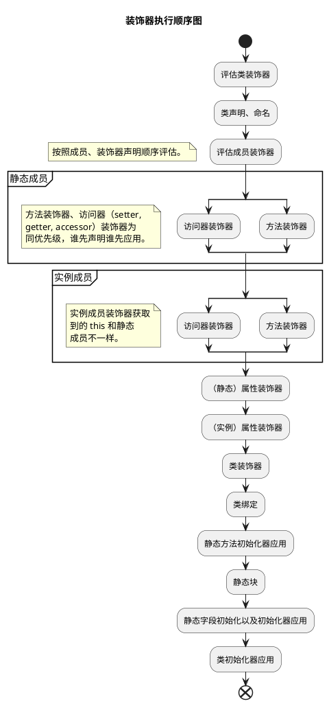
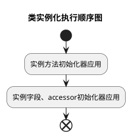

## TS 装饰器更新


关于 `TypeScript` 装饰器的知识请先阅读 [TypeScript装饰器（旧）]()


### 旧版装饰器

在 TypeScript 5.0 之前，装饰器的使用方式如下：

```typescript
function Log(target: any, propertyKey: string, descriptor: PropertyDescriptor) {
  const originalMethod = descriptor.value;
  descriptor.value = function (...args: any[]) {
    console.log(`Calling ${propertyKey} with arguments:`, args);
    return originalMethod.apply(this, args);
  };
  return descriptor;
}
```
这种装饰器的写法虽然功能强大，但存在一些问题，比如类型检查不够严格，装饰器的应用场景有限等。

### 新版装饰器

TypeScript 5.0 引入了全新的装饰器写法，解决了旧版装饰器的一些问题，并且提供了更强大的功能和更好的类型支持。新的装饰器写法如下：

```typescript
function Log<This, Args extends any[], Return>(
  originalMethod: (this: This, ...args: Args) => Return,
  context: ClassMethodDecoratorContext<This, (this: This, ...args: Args) => Return>
) {
  const methodName = String(context.name);
  return function (this: This, ...args: Args) {
    console.log(`Calling ${String(methodName)} with arguments:`, args);
    const result = originalMethod.call(this, ...args);
    return result;
  };
}
```

### 区别

**新旧装饰器的区别**

- **类型支持**：新版装饰器提供更好的类型支持！通过与 `TypeScript` 的类型系统结合，可以对被装饰的对象做严格的类型约束，减少类型错误。
- **入参**：旧版依赖 `descriptor` 获取信息，现在通过 `context` 获取信息以及进行元编程。
- **返回值**：旧版返回 `descriptor`，现在返回被修饰的实体。
- **MetaData**: `metadata` 单独被抽离到另一个提案 [Decorator Metadata](https://github.com/tc39/proposal-decorator-metadata)。
- **参数装饰器被移除**：于是新增提案 [ECMAScript Decorators for Class Method and Constructor Parameters](https://github.com/tc39/proposal-class-method-parameter-decorators)。


如果项目中使用到**参数装饰器**，则目前无法迁移到新版装饰器。例如：[`NestJS`](https://nestjs.com/)、[`TypeORM`](https://typeorm.io/)、[`InversifyJS`](https://inversify.io/)，以及我们大名鼎鼎的 [VSCode](https://github.com/microsoft/vscode)。


**新装饰器的优势**

- **更好的类型检查**：新版装饰器能够更好地与 TypeScript 的类型系统结合，提供更严格的类型检查。
- **更加优雅的元编程**：

## 新类型

详情参考 [Decorators](https://github.com/tc39/proposal-decorators) 以及 [decorators.d.ts](https://github.com/microsoft/TypeScript/blob/v5.6.3/src/lib/decorators.d.ts)。

通用的上下文类型（此处未按照官方声明编写，简化博文内容）：

```typescript
type DecoratorMetadataObject = Record<PropertyKey, unknown> & object;

type DecoratorMetadata = typeof globalThis extends { Symbol: { readonly metadata: symbol; }; }
  ? DecoratorMetadataObject
  : DecoratorMetadataObject | undefined;

interface CommonDecoratorContext<
  /** 静态时，为类构造器类型。非静态时，为类实例类型。 */
  This = unknown,
  /** 被装饰类型 */
  Value = unknown,
> {
  readonly kind: "method" | "setter" | "getter" | "accessor" | "field";
  readonly name: string | symbol;
  /** 是否为静态方法 */
  readonly static: boolean;
  /** 是否为私有方法 */
  readonly private: boolean;
  readonly access: Partial<{
    /** 确定对象是否具有与装饰元素同名的属性。 */
    has(object: This): boolean;
    /** 从提供的对象获取方法的当前值。 */
    get(object: This): Value;
    /** 在提供的对象上调用 setter。 */
    set(object: This, value: Value): void;
  }>;
  /** 静态时，添加类声明后的回调。非静态则添加类实例化后的回调。 */
  addInitializer(initializer: (this: This) => void): void;
  readonly metadata: DecoratorMetadata;
}

type ExtractCommonDecoratorAccess<
  This,
  Value,
  K extends keyof CommonDecoratorContext['access'] = keyof CommonDecoratorContext['access'],
> = Required<Pick<CommonDecoratorContext<This, Value>['access'], K>>;
```

### 类装饰器

类装饰器声明：

```typescript
interface ClassDecoratorContext<
  Class extends abstract new (...args: any) => any = abstract new (...args: any) => any,
> {
  readonly kind: "class";
  /** 被装饰器类的名称，当装饰匿名类时为 undefined */
  readonly name: string | undefined;
  /** 添加在类定义完成后调用的回调 */
  addInitializer(initializer: (this: Class) => void): void;
  readonly metadata: DecoratorMetadata;
}

type ClassDecoratorFunction<
  Class extends abstract new (...args: any) => any = abstract new (...args: any) => any,
> = (value: Class, context: ClassDecoratorContext<Class>) => Class | void;
```

重写上篇中的`Seal`：

```typescript
function Seal<Class extends new (...args: any) => any>(value: Class, context: ClassDecoratorContext) {
  context.addInitializer(() => console.log('Initializer'));
  Object.seal(value);
  Object.seal(value.prototype);
  return class extends value {
    constructor(...args: any[]) {
      super(...args);
      Object.seal(this);
    }
  };
}

@Seal
class MyClass {}
```

### 方法装饰器

```typescript
interface ClassMethodDecoratorContext<
  This = unknown,
  /** 被装饰方法的类型 */
  Value extends (this: This, ...args: any) => any = (this: This, ...args: any) => any,
> extends CommonDecoratorContext<This, Value> {
  readonly kind: "method";
  readonly access: ExtractCommonDecoratorAccess<This, Value, "has" | "get">;
}

type ClassMethodDecorator<
  This = unknown,
  Value extends (this: This, ...args: any) => any = (this: This, ...args: any) => any,
> = (value: Value, context: ClassMethodDecoratorContext<This, Value>) => Value | void;
```

编写一个装饰器，实现让方法绑定`this`。

```typescript
```

### 访问器装饰器

```typescript
interface ClassGetterDecoratorContext<
  This = unknown,
  /** 被装饰 getter 的类型 */
  Value = unknown,
> extends CommonDecoratorContext<This, Value> {
  readonly kind: 'getter';
  readonly access: ExtractCommonDecoratorAccess<This, Value, 'has' | 'get'>;
}

type ClassGetterDecorator<This = unknown, Value = unknown> = (
  value: () => Value,
  context: ClassGetterDecoratorContext<This, Value>
) => (() => Value) | void;

interface ClassSetterDecoratorContext<
  This = unknown,
  /** 被装饰 setter 的类型 */
  Value = unknown,
> extends CommonDecoratorContext<This, Value> {
  readonly kind: 'setter';
  readonly access: ExtractCommonDecoratorAccess<This, Value, 'has' | 'set'>;
}

type ClassSetterDecorator<This = unknown, Value = unknown> = (
  value: (v: Value) => void,
  context: ClassSetterDecoratorContext<This, Value>
) => ((v: Value) => void) | void;
```

```typescript
interface ClassAccessorDecoratorContext<
  This = unknown,
  /** 被装饰 getter 的类型 */
  Value = unknown,
> extends CommonDecoratorContext<This, Value> {
  readonly kind: "accessor";
  readonly access: ExtractCommonDecoratorAccess<This, Value>;
}

interface ClassAccessorDecoratorTarget<This, Value> {
  get(this: This): Value;
  set(this: This, value: Value): void;
}

interface ClassAccessorDecoratorResult<This, Value> {
  get?(this: This): Value;
  set?(this: This, value: Value): void;
  init?(this: This, value: Value): Value;
}

type ClassAccessorDecorator<This = unknown, Value = unknown> = (
  value: ClassAccessorDecoratorTarget<This, Value>,
  context: ClassAccessorDecoratorContext<This, Value>
) => ClassAccessorDecoratorResult<This, Value> | void;
```

### 属性装饰器

```typescript
interface ClassFieldDecoratorContext<
  This = unknown,
  /** 被装饰字段的类型 */
  Value = unknown,
> extends CommonDecoratorContext<This, Value> {
  readonly kind: 'field';
  readonly access: ExtractCommonDecoratorAccess<This, Value>;
}

type ClassFieldDecorator<This = unknown, Value = unknown> = (
  value: undefined,
  context: ClassFieldDecoratorContext<This, Value>
) => (initialValue: Value) => Value | void;
```

## TS 装饰器详情

### 代码分析

```typescript
'use strict';
const __runInitializers =
  (this && this.__runInitializers) ||
  function (thisArg, initializers, value) {
    const useValue = arguments.length > 2;
    for (let i = 0; i < initializers.length; i++) {
      value = useValue ? initializers[i].call(thisArg, value) : initializers[i].call(thisArg);
    }
    return useValue ? value : void 0;
  };
const __esDecorate =
  (this && this.__esDecorate) ||
  function (ctor, descriptorIn, decorators, contextIn, initializers, extraInitializers) {
    function accept(f) {
      if (f !== void 0 && typeof f !== 'function') {
        throw new TypeError('Function expected');
      }
      return f;
    }
    const kind = contextIn.kind,
      key = kind === 'getter' ? 'get' : kind === 'setter' ? 'set' : 'value';
    const target = !descriptorIn && ctor ? (contextIn['static'] ? ctor : ctor.prototype) : null;
    const descriptor = descriptorIn || (target ? Object.getOwnPropertyDescriptor(target, contextIn.name) : {});
    let _,
      done = false;
    for (let i = decorators.length - 1; i >= 0; i--) {
      const context = {};
      for (var p in contextIn) {
        context[p] = p === 'access' ? {} : contextIn[p];
      }
      for (var p in contextIn.access) {
        context.access[p] = contextIn.access[p];
      }
      context.addInitializer = function (f) {
        if (done) {
          throw new TypeError('Cannot add initializers after decoration has completed');
        }
        extraInitializers.push(accept(f || null));
      };
      const result = (0, decorators[i])(
        kind === 'accessor' ? { get: descriptor.get, set: descriptor.set } : descriptor[key],
        context
      );
      if (kind === 'accessor') {
        if (result === void 0) {
          continue;
        }
        if (result === null || typeof result !== 'object') {
          throw new TypeError('Object expected');
        }
        if ((_ = accept(result.get))) {
          descriptor.get = _;
        }
        if ((_ = accept(result.set))) {
          descriptor.set = _;
        }
        if ((_ = accept(result.init))) {
          initializers.unshift(_);
        }
      } else if ((_ = accept(result))) {
        if (kind === 'field') {
          initializers.unshift(_);
        } else {
          descriptor[key] = _;
        }
      }
    }
    if (target) {
      Object.defineProperty(target, contextIn.name, descriptor);
    }
    done = true;
  };
```

### 执行顺序



类实例化的顺序：



> - 装饰器执行顺序详见[源码注释](https://github.com/microsoft/TypeScript/blob/v5.6.3/src/compiler/transformers/esDecorators.ts#L193)

## 参考文献

- [Decorators](https://github.com/tc39/proposal-decorators)
- [Decorator Metadata](https://github.com/tc39/proposal-decorator-metadata)
- [Writing Well-Typed Decorators](https://devblogs.microsoft.com/typescript/announcing-typescript-5-0/#writing-well-typed-decorators)
- [TypeScript 5.0 将支持全新的装饰器写法！](https://mp.weixin.qq.com/s?__biz=MzkyMjQzNjMxNQ==&mid=2247484057&idx=2&sn=9af9009a56de9315c7f60d090e5db1c9)
- [TypeScript 5+装饰器变更的影响](https://juejin.cn/post/7277835425960099874)
- [全新 JavaScript 装饰器实战下篇：实现依赖注入](https://cloud.tencent.com/developer/article/2347383)
