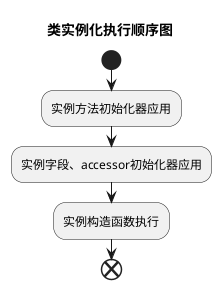

## TS 装饰器更新


关于 `TypeScript` 装饰器的知识请先阅读 [TypeScript装饰器（旧）]()


在 TypeScript 5.0 之前，装饰器的使用方式如下：

```typescript
function log(target: any, propertyKey: string, descriptor: PropertyDescriptor) {
  const originalMethod = descriptor.value;
  descriptor.value = function (...args: any[]) {
    console.log(`Calling ${propertyKey} with arguments:`, args);
    return originalMethod.apply(this, args);
  };
  return descriptor;
}
```
这种装饰器的写法虽然功能强大，但存在一些问题，比如类型检查不够严格、对元编程支持不足。TypeScript 5.0 引入了全新的装饰器写法，提供了更强大的功能和更好的类型支持。







新的装饰器写法如下：

```typescript
function log<This, Args extends any[], Return>(
  originalMethod: (this: This, ...args: Args) => Return,
  context: ClassMethodDecoratorContext<This, (this: This, ...args: Args) => Return>
) {
  return function (this: This, ...args: Args) {
    console.log(`Calling ${context.name} with arguments:`, args);
    return originalMethod.call(this, ...args);
  };
}
```

### 区别

**新旧装饰器的区别**

- **类型支持**：新版装饰器提供更好的类型支持！通过与 `TypeScript` 的类型系统结合，可以对被装饰的对象做严格的类型约束，减少类型错误。
- **入参**：旧版依赖 `descriptor` 获取信息，现在通过 `context` 获取信息以及进行元编程。
- **返回值**：旧版返回 `descriptor`，现在返回被修饰的实体。
- **MetaData**: `metadata` 单独被抽离到另一个提案 [Decorator Metadata](https://github.com/tc39/proposal-decorator-metadata)。
- **参数装饰器被移除**：于是新增提案 [ECMAScript Decorators for Class Method and Constructor Parameters](https://github.com/tc39/proposal-class-method-parameter-decorators)。


如果项目中使用到**参数装饰器**，则目前无法迁移到新版装饰器。例如：[`NestJS`](https://nestjs.com/)、[`TypeORM`](https://typeorm.io/)、[`InversifyJS`](https://inversify.io/)，以及我们大名鼎鼎的 [VSCode](https://github.com/microsoft/vscode)。


**新装饰器的优势**

- **更好的类型检查**：新版装饰器能够更好地与 TypeScript 的类型系统结合，提供更严格的类型检查。
- **更加优雅的元编程**： 封装`has`、`set`、`get`等访问方法。

### 总评

参考上一篇中私对[参数注入](#%E5%8F%82%E6%95%B0%E8%A3%85%E9%A5%B0%E5%99%A8%E8%AE%A8%E8%AE%BA)的推崇，私认为使用新版本装饰器缺少 *参数装饰器* 是一个硬伤。对于不使用依赖注入的项目，可以尝试新装饰器，体验方便又类型严格的装饰器开发。其它情况都***不推荐***。

~~大概等十年，参数装饰器提案通过后，我们就可以尝试使用。~~

## 新类型

详情参考 [Decorators](https://github.com/tc39/proposal-decorators) 以及 [decorators.d.ts](https://github.com/microsoft/TypeScript/blob/v5.6.3/src/lib/decorators.d.ts)。

通用的上下文类型（此处未按照官方声明编写，简化博文内容）：

```typescript
type DecoratorMetadataObject = Record<PropertyKey, unknown> & object;

type DecoratorMetadata = typeof globalThis extends { Symbol: { readonly metadata: symbol; }; }
  ? DecoratorMetadataObject
  : DecoratorMetadataObject | undefined;

interface CommonDecoratorContext<
  /** 静态时，为类构造器类型。非静态时，为类实例类型。 */
  This = unknown,
  /** 被装饰类型 */
  Value = unknown,
> {
  readonly kind: "method" | "setter" | "getter" | "accessor" | "field";
  readonly name: string | symbol;
  /** 是否为静态方法 */
  readonly static: boolean;
  /** 是否为私有方法 */
  readonly private: boolean;
  readonly access: Partial<{
    /** 确定对象是否具有与装饰元素同名的属性。 */
    has(object: This): boolean;
    /** 从提供的对象获取方法的当前值。 */
    get(object: This): Value;
    /** 在提供的对象上调用 setter。 */
    set(object: This, value: Value): void;
  }>;
  /** 静态时，添加类声明后的回调。非静态则添加类实例化后的回调。 */
  addInitializer(initializer: (this: This) => void): void;
  readonly metadata: DecoratorMetadata;
}

type ExtractCommonDecoratorAccess<
  This,
  Value,
  K extends keyof CommonDecoratorContext['access'] = keyof CommonDecoratorContext['access'],
> = Required<Pick<CommonDecoratorContext<This, Value>['access'], K>>;
```

新版本装饰器的入参基本相同（初始值、上下文），主要区别在上下文内以及返回值。

### 类装饰器

**返回值**：如果返回非空则替换原类。

```typescript
interface ClassDecoratorContext<
  Class extends abstract new (...args: any) => any = abstract new (...args: any) => any,
> {
  readonly kind: "class";
  /** 被装饰器类的名称，当装饰匿名类时为 undefined */
  readonly name: string | undefined;
  /** 添加在类定义完成后调用的回调 */
  addInitializer(initializer: (this: Class) => void): void;
  readonly metadata: DecoratorMetadata;
}

type ClassDecoratorFunction<
  Class extends abstract new (...args: any) => any = abstract new (...args: any) => any,
> = (value: Class, context: ClassDecoratorContext<Class>) => Class | void;
```

重写上篇中的`seal`：

```typescript
function seal<Class extends new (...args: any) => any>(value: Class, context: ClassDecoratorContext) {
  Object.seal(value);
  Object.seal(value.prototype);
  return class extends value {
    constructor(...args: any[]) {
      super(...args);
      Object.seal(this);
    }
  };
}

@seal
class MyClass {}
```

### 方法装饰器

**返回值**：如果返回非空则替换原函数。

```typescript
interface ClassMethodDecoratorContext<
  This = unknown,
  /** 被装饰方法的类型 */
  Value extends (this: This, ...args: any) => any = (this: This, ...args: any) => any,
> extends CommonDecoratorContext<This, Value> {
  readonly kind: "method";
  readonly access: ExtractCommonDecoratorAccess<This, Value, "has" | "get">;
}

type ClassMethodDecorator<
  This = unknown,
  Value extends (this: This, ...args: any) => any = (this: This, ...args: any) => any,
> = (value: Value, context: ClassMethodDecoratorContext<This, Value>) => Value | void;
```

编写一个装饰器，实现让方法绑定`this`。

```typescript
function autoBind<This, Value extends (this: This, ...args: any) => any>(
  value: Value,
  { name, addInitializer }: ClassMethodDecoratorContext<This, Value>
) {
  addInitializer(function () {
    (<any>this)[name] = value.bind(this);
  });
}
```

### 访问器装饰器

**返回值**：同方法装饰器，如果返回非空则替换访问器。

```typescript
interface ClassGetterDecoratorContext<
  This = unknown,
  /** 被装饰 getter 的类型 */
  Value = unknown,
> extends CommonDecoratorContext<This, Value> {
  readonly kind: 'getter';
  readonly access: ExtractCommonDecoratorAccess<This, Value, 'has' | 'get'>;
}

type ClassGetterDecorator<This = unknown, Value = unknown> = (
  value: () => Value,
  context: ClassGetterDecoratorContext<This, Value>
) => (() => Value) | void;

interface ClassSetterDecoratorContext<
  This = unknown,
  /** 被装饰 setter 的类型 */
  Value = unknown,
> extends CommonDecoratorContext<This, Value> {
  readonly kind: 'setter';
  readonly access: ExtractCommonDecoratorAccess<This, Value, 'has' | 'set'>;
}

type ClassSetterDecorator<This = unknown, Value = unknown> = (
  value: (v: Value) => void,
  context: ClassSetterDecoratorContext<This, Value>
) => ((v: Value) => void) | void;
```

`accessor`装饰器比较特殊，同时有`getter`、`setter`以及`field`装饰器的效果。在参数和返回值上，`accessor`装饰器也是这三个装饰器的合集。

**参数**：`value` 是包含 `get` 方法和 `set` 方法的对象。
**返回值**：如果返回值包含 `get`、`set` 方法，替换对应访问器。如果包含 `init` 方法则使用其返回值初始化私有属性。`init` 的参数为上一个装饰器 `init` 返回值或者初始值。

```typescript
interface ClassAccessorDecoratorContext<
  This = unknown,
  /** 被装饰 getter 的类型 */
  Value = unknown,
> extends CommonDecoratorContext<This, Value> {
  readonly kind: "accessor";
  readonly access: ExtractCommonDecoratorAccess<This, Value>;
}

interface ClassAccessorDecoratorTarget<This, Value> {
  get(this: This): Value;
  set(this: This, value: Value): void;
}

interface ClassAccessorDecoratorResult<This, Value> {
  get?(this: This): Value;
  set?(this: This, value: Value): void;
  init?(this: This, value: Value): Value;
}

type ClassAccessorDecorator<This = unknown, Value = unknown> = (
  value: ClassAccessorDecoratorTarget<This, Value>,
  context: ClassAccessorDecoratorContext<This, Value>
) => ClassAccessorDecoratorResult<This, Value> | void;
```

### 属性装饰器

**返回值**：为空或者函数。如果返回值为函数，在类初始化阶段将使用函数返回值作为属性的初始化值。

```typescript
interface ClassFieldDecoratorContext<
  This = unknown,
  /** 被装饰字段的类型 */
  Value = unknown,
> extends CommonDecoratorContext<This, Value> {
  readonly kind: 'field';
  readonly access: ExtractCommonDecoratorAccess<This, Value>;
}

type ClassFieldDecorator<This = unknown, Value = unknown> = (
  value: undefined,
  context: ClassFieldDecoratorContext<This, Value>
) => (initialValue: Value) => Value | void;
```

对比上一版本的[DI依赖注入](#di%E4%BE%9D%E8%B5%96%E6%B3%A8%E5%85%A5)，需要通过在原型上插入访问属性，实现注入元素和实例绑定。新版本装饰器增加的上下文以及初始化器很好的解决了这个问题，只需要返回一个初始化函数就可以在类被实例化的时候执行。

> PS: 旧版装饰器其实也可以解决这个问题，只不过需要和其他装饰器配合才可以。例如以下俩个方案：
> - 通过和旧参数装饰器配合，将注入的依赖作为初始化参数传入。
> - 通过和类装饰器配合，在类初始化后，将属性装饰器收集到的依赖绑定好。

```typescript
function injected<This = unknown, Value = unknown>(key: string) {
  return (
    value: undefined,
    context: ClassFieldDecoratorContext<This, Value>
  ) {
    return () => container.instantiate(key)
  }
}
```

## TS 装饰器详情

### Demo

{{<playground id="decorator-example" theme="dark" tab="js" tsc="{}" >}}

function Test(name: string) {
  console.log(`${name} decorator created`);
  return function(value: any, context: {
    addInitializer: (initializer: () => void) => void;
  }) {
    console.log(`${name} decorator apply`, value, context);
    context.addInitializer(() => {
      console.log(`${name} decorator run initializer`);
    })
  }
}

@Test('class')
class MyClass {
  static {
    console.log("static block")
  }

  @Test('props')
  public prop1: number = 0;

  @Test('static props')
  public static PROPS: number = 1010;

  @Test('method')
  public greet(a: number): void { }

  @Test('static method')
  public static METHOD() {}

  constructor(public data: string) { }

  @Test('getter')
  public get prop() {
    return this.prop1;
  }

  @Test('accessor')
  public accessor haha: number = 10;

  @Test('setter')
  public set prop(data: number) {
    this.prop1 = data;
  }
}

console.log('main')
const a = new MyClass('name');



### 执行顺序


类实例化的顺序：



> - 装饰器执行顺序详见[源码注释](https://github.com/microsoft/TypeScript/blob/v5.6.3/src/compiler/transformers/esDecorators.ts#L193)

## 参考文献

- [Writing Well-Typed Decorators](https://devblogs.microsoft.com/typescript/announcing-typescript-5-0/#writing-well-typed-decorators)
- [TypeScript 5.0 将支持全新的装饰器写法！](https://mp.weixin.qq.com/s?__biz=MzkyMjQzNjMxNQ==&mid=2247484057&idx=2&sn=9af9009a56de9315c7f60d090e5db1c9)
- [TypeScript 5+ 装饰器变更的影响](https://juejin.cn/post/7277835425960099874)
- [全新 JavaScript 装饰器实战下篇：实现依赖注入](https://cloud.tencent.com/developer/article/2347383)
